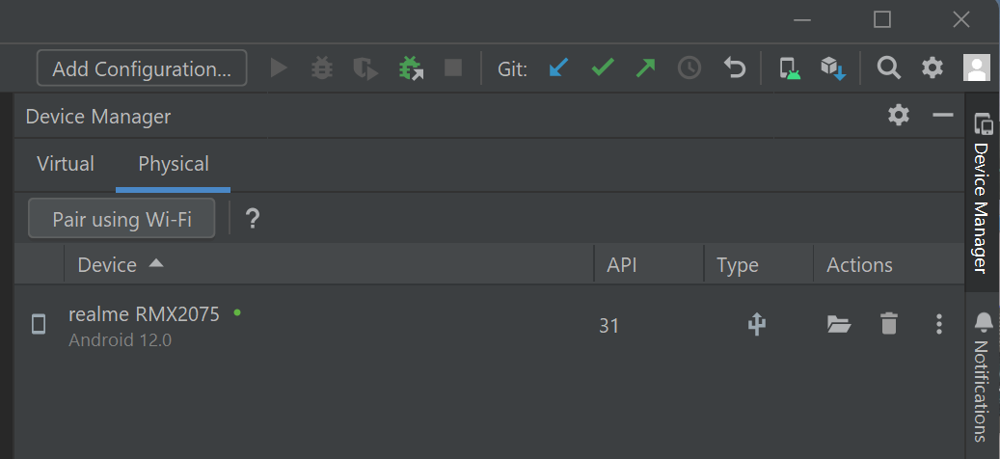

# M1 Demo Tutorial (follow-up phase 2)

The goal of this demonstration is to showcase the new garbling scheme evaluation performance on mobile.

So, to simplify and streamline the demo, we have compiled the app in an offline demo mode. This mode utilizes a pre-computed test circuit generated with the new garbling scheme and does not require the app to connect with the blockchain like in M5.


> Please note that despite the current performance of approximately 60-35 frames per second on an mid-end device, reading the screen still imposes a significant cognitive load on the brain to interpret the digits displayed on both the message screen and pinpad. This means that for individuals who are not accustomed to this particular exercise, it may take a few seconds to recognize the digits. However, there will be substantial improvements in this aspect in the next milestone.


## Demo with an android device or an emulator


### 1. Install the wallet App i.e APK file on an android device or an emulator


#### 1.1 Retrieve the APK file
Download the [APK file](https://github.com/Interstellar-Network/wallet-app/releases/tag/w3f-phase2-milestone1)


#### 1.2 Install the APK
##### 1.2.1 on an android device

[How to install an APK on Android](https://www.lifewire.com/install-apk-on-android-4177185)

 WARNING: ensure that your device is configure for english.


##### 1.2.2 on an emulator

[Install Android studio](https://developer.android.com/studio/)

Install the pixel 5 API 31 emulator with Virtual Device Manager.


Wait for the emulator to launch and emulated device to power on and drag and drop the APK file on the emulator to install the App.


### 2.Launch the Android App
Swipe from bottom to top and click on `Wallet Interstellar`


### 3. Send a Currency and wait for the Transaction confirmation screen to validate the transaction


#### 3.1 Select currency and contact
Following is an explicit video showing how to send a curency to a contact on SEND screen.


#### 3.2 Click on the blue Check icon

#### 3.3 Wait for the transaction validation screen to appear

#### 3.4 Check the fps result
Use logcat on android studio and type "fps" string in the filter to see the average frame per second in the logs.

> if the app is installed on a device, connect your android device with usb or wifi (it is required to set-up develloper mode on the device) with android studio physical device to see the logs with logcat.




Examples of benchs with a mobile device with an ARM [Snapdragon 870 5G](https://www.qualcomm.com/products/mobile/snapdragon/smartphones/snapdragon-8-series-mobile-platforms/snapdragon-870-5g-mobile-platform)

```sh
07-11 12:18:29.641 31983 32048 I event /home/pratn/.cargo/registry/src/github.com-1ecc6299db9ec823/bevy_diagnostic-0.10.1/src/l frame_time                      :   14.415149ms (avg 14.349391ms)
07-11 12:18:29.641 31983 32048 I event /home/pratn/.cargo/registry/src/github.com-1ecc6299db9ec823/bevy_diagnostic-0.10.1/src/l fps                             :   70.215818   (avg 70.413543)
07-11 12:18:28.635 31983 32049 I event /home/pratn/.cargo/registry/src/github.com-1ecc6299db9ec823/bevy_diagnostic-0.10.1/src/l frame_time                      :   15.271250ms (avg 14.889102ms)
07-11 12:18:28.635 31983 32049 I event /home/pratn/.cargo/registry/src/github.com-1ecc6299db9ec823/bevy_diagnostic-0.10.1/src/l fps                             :   65.985581   (avg 67.726191)
07-11 12:18:27.636 31983 32050 I event /home/pratn/.cargo/registry/src/github.com-1ecc6299db9ec823/bevy_diagnostic-0.10.1/src/l frame_time                      :   13.855163ms (avg 13.978516ms)
07-11 12:18:27.636 31983 32050 I event /home/pratn/.cargo/registry/src/github.com-1ecc6299db9ec823/bevy_diagnostic-0.10.1/src/l fps                             :   72.801836   (avg 72.240550)
```