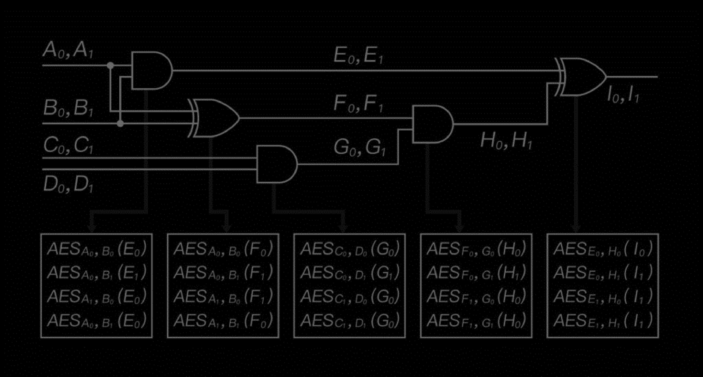

# Garbled Circuit Overview

## Basic Garbled Circuit structure overview

A garbled circuit is a cryptographic obfuscation technique and a cryptographic algorithm that ensures computation privacy i.e. manages the protection of a boolean circuit that can be executed without leaking information. Neither the semantics of boolean operators (AND, OR, XOR, etc.) that make up the circuit nor the semantics of inputs and outputs of the circuit will be revealed to the attackers through reverse-engineering or brute force attacks.

- Inputs and outputs are Garbled Values i.e. 128 bits token indistinguishable from random with a secret semantic value of 0 or 1 only known by the nodes
- Each boolean operator is implemented in the circuit by an encrypted truth table, decrypted by its respective Garbled Values inputs.

[Foundation of Garbled Circuits, Viet Tung Hoang, B.S.](https://www.cs.fsu.edu/~tvhoang/thesis.pdf)

we have develloped a new garbling scheme implementation, from scratch, based on the following whitepapers: [A New Framework for Garbled Circuits](https://www.esat.kuleuven.be/cosic/publications/article-3351.pdf) and [A New Approach to Garbled Circuits](https://eprint.iacr.org/2021/739.pdf). This new scheme proven secure against PPT adversary, achieves a major performance improvement compared to the previous method i.e Fancy Garble and JustGarbled, while still incorporating the transaction message within the circuit. Our optimizations, including parallelization, free gates, and especially tight memory managment, contribute to this significant boost in performance.
