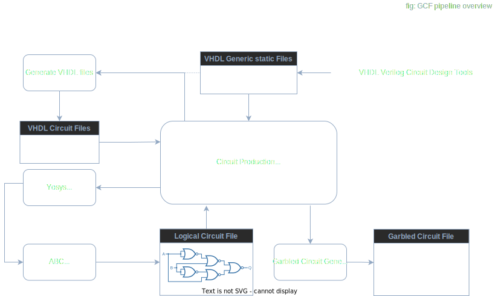

# Intoduction to Garbled Circuit Factory (GCF)

The Garble Circuit Factory is the module in charge of building the Garbled Circuits (GC) used by the Interstellar infrastructure.

Following is a high level overview of the generic pipeline used to generate GC.

