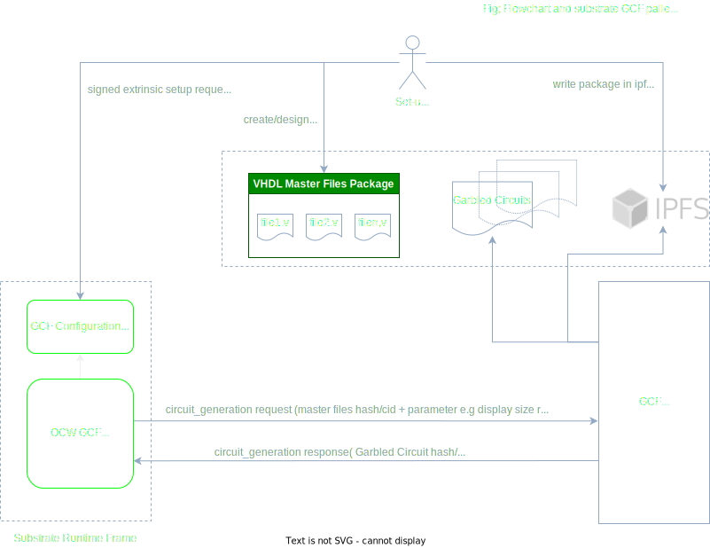

# Garbled Cicuit Factory APIs

Description of the APIs called from substrate modules to manage circuits production. Those APis are pretty generic and can be adapted to different types of circuit production.

> [IPFS](https://ipfs.io/) is used by the external GCF service for configuration files and produced garbled circuits. Although, for now only ipfs hash/cid are used in substrate modules. At a later stage we could include substrate  ipfs solutions like [OCW ipfs](https://rs-ipfs.github.io/offchain-ipfs-manual/) for other use case e.g Secure Multi Party Computation. In that case pre-computed Garbled Circuit could be loaded from ipfs to be evaluated within a pallet module to manage SMPC protocols.

## Flowchart and  substrate GCF pallets




## APIs
This is a list of the APIs used in substrate framework to pilot the generation of the Garbled Circuits required  by the Interstellar infrastructure.

### Launh circuit production from OCW on GCF (external service)

`generate_circuit`: [api_circuits/src/circuit_routes.rs:17](https://github.com/Interstellar-Network/api_circuits/blob/main/src/circuits_routes.rs#L17)

`Request`   : start the circuit(s) generation with hash/cid  of master files + parameter related to circuit production e.g size/resolution of display circuits

`Response`  : get hash/cid of the circuit on ipfs

`Status`    : circuit production state


circuit_route.rs

```rust,editable
use tonic::{Request, Response, Status};

use interstellarpbapicircuits::circuits_api_server::CircuitsApi;
use interstellarpbapicircuits::circuits_api_server::CircuitsApiServer;
use interstellarpbapicircuits::CircuitReply;
use interstellarpbapicircuits::Empty;

pub mod interstellarpbapicircuits {
    tonic::include_proto!("interstellarpbapicircuits");
}

#[derive(Default)]
pub struct CircuitsServerImpl {}

#[tonic::async_trait]
impl CircuitsApi for CircuitsServerImpl {
    async fn generate_circuit(
        &self,
        request: Request<Empty>,
    ) -> Result<Response<CircuitReply>, Status> {
        println!("Got a request from {:?}", request.remote_addr());

        // TODO call the C++ wrapper
        // TODO store into IPFS
        let ipfs_hash = "123456";

        let reply = CircuitReply {
            hash: format!("Hello {}!", ipfs_hash),
        };
        Ok(Response::new(reply))
    }
}
```