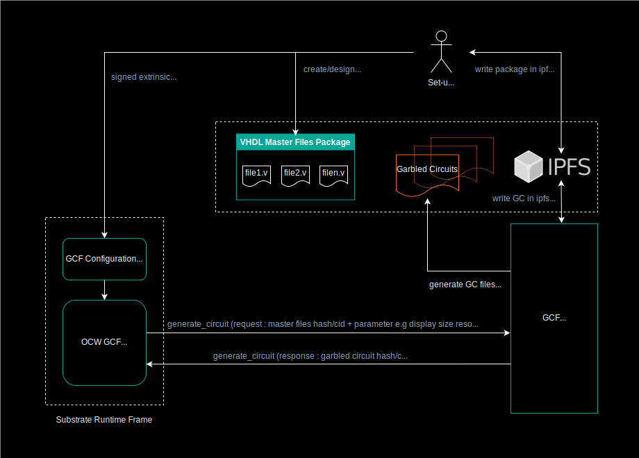

# Garbled Cicuit Factory APIs

Description of the APIs called from substrate modules to manage circuits production. Those APis are pretty generic and can be adapted to different types of circuit production.

> [IPFS](https://ipfs.io/) is used by the external GCF service for the storage of both configuration files and produced garbled circuits. Although, for now only ipfs hash/cid are used in the GCF substrate modules. At a later stage we could include substrate ipfs solutions like [OCW ipfs](https://rs-ipfs.github.io/offchain-ipfs-manual/) to deal with other use cases e.g Secure Multi Party Computation. In that case pre-computed Garbled Circuit could be loaded from ipfs to be evaluated within a pallet module to manage an SMPC protocol with others parties.

## Flowchart and  substrate GCF pallets





## GCF APIs
This is a list of the APIs used in substrate framework to pilot the generation of the Garbled Circuits required  by the Interstellar infrastructure.

### Launh circuit generation from OCW on GCF (external service)

`generate_circuit`: [api_circuits/src/circuit_routes.rs:61](https://github.com/Interstellar-Network/api_circuits/blob/main/src/circuits_routes.rs#L61)

`Request`   : start the circuit(s) generation with hash/cid  of master files + parameter related to circuit production e.g size/resolution of display circuits

`Response`  : get hash/cid of the circuit on ipfs

`Status`    : circuit production state


circuit_route.rs - generation of  display circuit
```rust,editable
#[tonic::async_trait]
impl SkcdApi for SkcdApiServerImpl {
    async fn generate_skcd_display(
        &self,
        request: Request<SkcdDisplayRequest>,
    ) -> Result<Response<SkcdDisplayReply>, Status> {
        log::info!(
            "generate_skcd_display request from {:?}",
            request.remote_addr()
        );
        let width = request.get_ref().width;
        let height = request.get_ref().height;

        // TODO class member/Trait for "lib_circuits_wrapper::ffi::new_circuit_gen_wrapper()"
        let lib_circuits_wrapper = tokio::task::spawn_blocking(move || {
            let wrapper = lib_circuits_wrapper::ffi::new_circuit_gen_wrapper();

            let skcd_pb_buf = wrapper.GenerateDisplaySkcd(width, height);

            skcd_pb_buf
        })
        .await
        .unwrap();

        let data = Cursor::new(lib_circuits_wrapper);

        // TODO error handling, or at least logging
        let ipfs_result = self.ipfs_client().add(data).await.unwrap();

        let reply = SkcdDisplayReply {
            skcd_cid: format!("{}", ipfs_result.hash),
        };

        Ok(Response::new(reply))
    }
```

For generic circuits:

```rust,editable
async fn generate_skcd_generic_from_ipfs(
        &self,
        request: Request<SkcdGenericFromIpfsRequest>,
    ) -> Result<Response<SkcdGenericFromIpfsReply>, Status> {
        log::info!(
            "generate_skcd_generic_from_ipfs request from {:?}",
            request.remote_addr()
        );

        let verilog_cid = &request.get_ref().verilog_cid;

        // get the Verilog (.v) from IPFS
        // DO NOT use dag_get if the file was "add"
        // The returned bytes would be eg
        // {"Data":{"/":{"bytes":"CAISjgQvL....ZfYWRkGI4E"}},"Links":[]}
        // let verilog_buf = self
        //     .ipfs_client()
        //     .dag_get(&verilog_cid)
        //     .map_ok(|chunk| chunk.to_vec())
        //     .try_concat()
        //     .await
        //     .unwrap();
        let verilog_buf = self
            .ipfs_client()
            .cat(&verilog_cid)
            .map_ok(|chunk| chunk.to_vec())
            .try_concat()
            .await
            .unwrap();

        // write the buffer to a file in /tmp
        // yosys/abc REQUIRE file b/c they are basically cli
        // so either write it on Rust side, or send as std::string to C++ and write it there
        let tmp_dir = Builder::new()
            .prefix("interstellar-circuit_routes-generate_skcd_generic_from_ipfs")
            .tempdir()
            .unwrap();
        let verilog_file_path = tmp_dir.path().join("input.v");
        std::fs::write(&verilog_file_path, verilog_buf).expect("could not write");

        // TODO class member/Trait for "lib_circuits_wrapper::ffi::new_circuit_gen_wrapper()"
        let lib_circuits_wrapper = tokio::task::spawn_blocking(move || {
            let wrapper = lib_circuits_wrapper::ffi::new_circuit_gen_wrapper();

            let skcd_pb_buf =
                wrapper.GenerateGenericSkcd(verilog_file_path.as_os_str().to_str().unwrap());

            skcd_pb_buf
        })
        .await
        .unwrap();

        let data = Cursor::new(lib_circuits_wrapper);

        // TODO error handling, or at least logging
        let ipfs_result = self.ipfs_client().add(data).await.unwrap();

        let reply = SkcdGenericFromIpfsReply {
            skcd_cid: format!("{}", ipfs_result.hash),
        };

        Ok(Response::new(reply))
    }
}