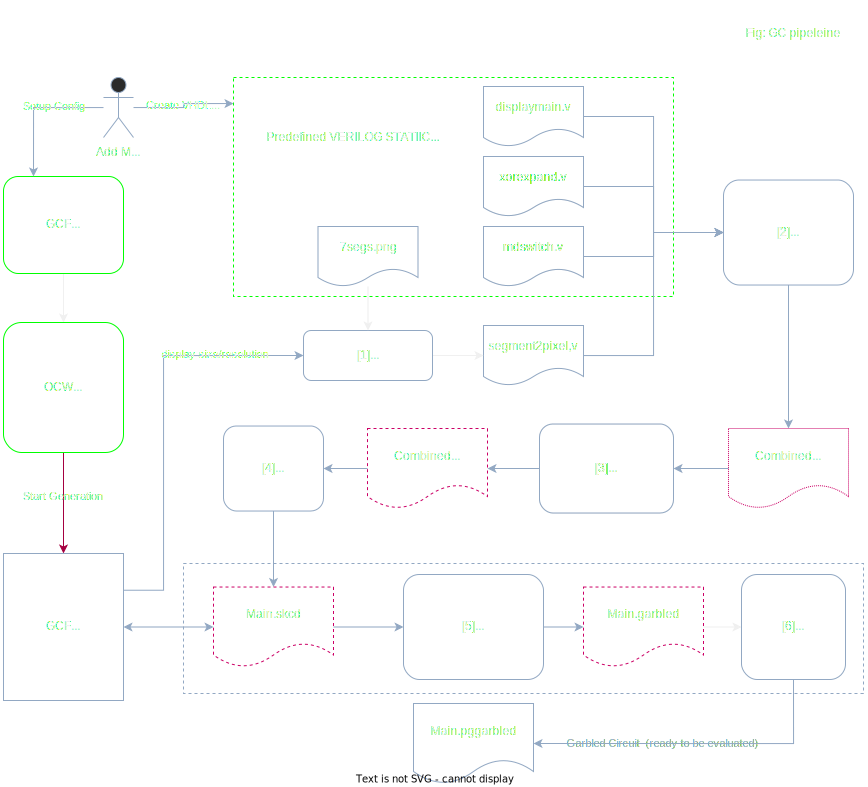

# Detailed Pipeline for Display Circuits Production

This is the Garbled Circuits generation detailed pipeline for the Transaction Validation screen use case.

It illustrates the way Garbled Circuit Factory can be used with substrate OCWs for the production of the display garbled circuits used by Interstellar.

## Pipeline


NOTE: the file types are mentioned for clarity and to allow matching with calling the executables (e.g. Yosys or ABC) manually, but in practice after [2] all is done in memory, and cached.


**On the following schema, cached files are represented with red doted line**

> **The red arrow represents the command to lauch the circuit generation pipeline from OCW GCF**




Overview : 

`[1] Generate~` “segment2pixel.v” using internal code [using e.g. 7segs.png]

` [2] Verilog  → .blif `: combine all Verilog(displaymain+xorexpand+rndswitch+segment2pixel) using Yosys

`[3] .blif → .blif.blif `: optimization /synthesis : using ABC

`[4] Parsing .blif → .skcd `: using internal code

`[5] Garbling .skcd → .garbled`: using JustGarble

`[6] Finalize/Serialize .garbled → .pgarbled`: Using internal code; allows for parallel eval of a Garbled Circuit


### [1] Generate “segment2pixel.v”

Note : this is the only file in the pipeline that needs to be regenerated when changing size/resolution. The rest (displaymain+xorexpand+rndswitch) are static, and the size/resolution is handled by passing the appropriate “`define” to Yosys.

This allows to cache the resulting .skcd of the whole pipeline (cf `CircuitPipeline::GenerateDisplaySkcd`) using `segment2pixel.v` **content as cache key**.

7segs.png (or other*) is parsed from an embedded resource into the executable, and prepared for later use (and some pre-computation is done based on the colors of the .png)

`Segments2Pixels::Segments2Pixels`: [lib_circuits/src/segments2pixels/segments2pixels.cpp:137](https://github.com/Interstellar-Network/lib_circuits/blob/initial/src/segments2pixels/segments2pixels.cpp#L137)

Then the generation of `segment2pixel.v` VHDL file

`Segments2Pixels::GenerateVerilog`: [ lib_circuits/src/segments2pixels/segments2pixels.cpp:137](https://github.com/Interstellar-Network/lib_circuits/blob/initial/src/segments2pixels/segments2pixels.cpp#L137)

A “bitmap” is generated with the correct number of digits at the correct positions [in relative coords]
E.g. 2-4 digits in the center of the “message window”, and 10 digits vertically oriented for the “pinpad window”
If there is an in-memory .skcd cached for this particular “segment2pixel.v” it is returned and that part is done

```cpp, editable
std::string Segments2Pixels::GenerateVerilog() {
  std::string verilog_buf;
  unsigned int nb_inputs = _nb_segments - 1,
               nb_outputs = (_width * _height) - 1;

  // without reserve : 1657472 - 1771623 (ns)
  // with reserve : 1250652 - 1356733 (ns)
  // Now in the .v, ranges are encoded as eg: assign p[75295:75287] = 0;
  // So we really do not need much memory.
  unsigned int nb_pixels = _width * _height;
  size_t size_to_reserve =
      ((nb_pixels * strlen("assign p[000000] = s[0000];\n")) / 5) + 1000;
  verilog_buf.reserve(size_to_reserve);

  verilog_buf += "// module to convert segments into an image bitmap\n";
  verilog_buf +=
      "// generated by lib_circuits/src/segments2pixels/segments2pixels.cpp\n";
  verilog_buf += "// (c) Interstellar\n\n";

  verilog_buf += "module segment2pixel(s, p);  // convert segments to pixels\n";
  // TODO
  verilog_buf +=
      fmt::format("input [{:d}:0] s; // segments to display\n", nb_inputs);
  verilog_buf +=
      fmt::format("output [{:d}:0] p;  // pixels output\n", nb_outputs);

  // TODO proper values (decode RLE)
  // TODO use absl or fmtlib
  size_t pixels_counter = 0;
  for (const auto& it : _bitmap_seg_ids_rle) {
    // - OFF segment(seg_id==-1):   "assign p[10610:10609] = 0;"
    // - ON segment(eg seg_id=16):  "assign p[17855:17854] = s[16];"
    auto seg_id = it.value;
    auto len = it.size;
    if (seg_id == -1) {
      // NOTE: range inverted! written as eg [7680:0] not [0:7680]
      verilog_buf += "assign p[";
      verilog_buf += fmt::format_int(pixels_counter + len - 1).str();
      verilog_buf += ":";
      verilog_buf += fmt::format_int(pixels_counter).str();
      verilog_buf += "] = ";
      verilog_buf += "0;\n";
    } else {
      // When a valid seg_id, we CAN NOT write eg "assign p[7456:7412] = s[14];"
      // This is NOT valid verilog, apparently
      // verilator --lint-only: "Operator ASSIGNW expects 47 bits on the Assign
      // RHS, but Assign RHS's SEL generates 1 bits."
      for (uint32_t j = pixels_counter; j < pixels_counter + len; ++j) {
        verilog_buf += "assign p[";
        verilog_buf += fmt::format_int(j).str();
        verilog_buf += "] = ";
        verilog_buf += "s[";
        verilog_buf += fmt::format_int(seg_id).str();
        verilog_buf += "];\n";
      }
    }
    pixels_counter += len;
  }

  verilog_buf += "endmodule";

  return verilog_buf;
}
```
> We can use other files like 14segs.png to handle segment based visual cryptography down the road


### [2][3][4] Generate .skcd

The big steps are self-explanatory (pretty much just calling ABC or Yosys, and handling/parsing the results or errors; most of the business logic is in step [1]) :

`CircuitPipeline::GenerateSkcd`: [lib_circuits/src/circuit_lib.cpp:19](https://github.com/Interstellar-Network/lib_circuits/blob/initial/src/circuit_lib.cpp#L19)

```cpp, editable
void GenerateSkcd(boost::filesystem::path skcd_output_path,
                  const std::vector<std::string_view> &verilog_inputs_paths,
                  const utils::TempDir &tmp_dir) {
  auto output_blif_path = tmp_dir.GetPath() / "output.blif";

  VerilogHelper::CompileVerilog(verilog_inputs_paths,
                                output_blif_path.generic_string());

  // [?] abc pass: .blif containing multiple models
  // -> .blif.blif with "main" only
  //
  // append NOT join else the final path is eg
  // "/tmp/interstellar-circuits/XXX/output.blif/.blif"
  auto final_blif_blif_path = output_blif_path.generic_string() + ".blif";
  interstellar::ABC::Run(output_blif_path.generic_string(),
                         final_blif_blif_path);

  // convert .blif.blif -> ~.skcd
  // NOTE: Skcd class was previously used to pass the data around, but it has
  // been replaced by protobuf serialization
  auto blif_parser = BlifParser();
  auto tmp_blif_blif_str = utils::ReadFile(final_blif_blif_path);
  blif_parser.ParseBuffer(tmp_blif_blif_str, true);

  // [?]
  interstellar::skcd::WriteToFile(skcd_output_path, blif_parser);
}
```

If there is no cached .skcd for the step [1], one is generated with 
`CircuitPipeline::GenerateDisplaySkcd`: [lib_circuits/src/circuit_lib.cpp:56](https://github.com/Interstellar-Network/lib_circuits/blob/initial/src/circuit_lib.cpp#L56)

```cpp, editable
void GenerateDisplaySkcd(boost::filesystem::path skcd_output_path,
                         u_int32_t width, u_int32_t height) {
  auto tmp_dir = utils::TempDir();

  // [1] generate Verilog segments2pixels.v
  auto segment2pixels = Segments2Pixels(width, height);
  auto segment2pixels_v_str = segment2pixels.GenerateVerilog();

  // write this to segments2pixels.v (in the temp dir)
  // because Yosys only handles files, not buffers
  auto segments2pixels_v_path = tmp_dir.GetPath() / "segments2pixels.v";
  utils::WriteToFile(segments2pixels_v_path, segment2pixels_v_str);

  auto defines_v_str = segment2pixels.GetDefines();
  // write this to defines.v (in the temp dir)
  // because Yosys only handles files, not buffers
  auto defines_v_path = tmp_dir.GetPath() / "defines.v";
  utils::WriteToFile(defines_v_path, defines_v_str);
```  

### [5][6] Garbling

Pretty straitforward call to `lib_garble` library

`ParallelGarbledCircuit GarbleSkcd`: [lib_garble/src/justgarble/garble_helper.cpp:16](https://github.com/Interstellar-Network/lib_garble/blob/initial/src/justgarble/garble_helper.cpp#L16)

>This part is related to the management of display circuit OTP related to M3

Technically garbling + “stripping” (i.e. generating the “pre-packmsg”).
This is at this step that the pinpad/OTP randomness is introduced, i.e. the .skcd generated at the previous step CAN/SHOULD be reused (and it is) all the time (i.e. it is always reused, except when changing size or resolution).

We can manage 2 modes: on the fly generation and pre-computation of randomized circuits ( with random pinpad and OTP) with whithout transaction message.
The second mode will use “stripped circuits” sent to a device ahead of time and the “pre-packmsg” is stored in the DB.
Then when creating a transaction, the “pre-packmsg” is used to generate the correct “packmsg” with the desired transaction  message (e.g. “Do you authorize sending X BTC to Y address”), and then send it to the Device.
The Device then combines the “packmsg” and the “stripped circuits” and proceed to evaluate the circuits (= generating the final bitmap, one for each frame at the target 60+ FPS).

Regarding Transaction Validation displays, sending the circuits ahead of time is no mandatory (i.e. the generation is fast enough, and the size small enough to be able to get them on the spot even on a mobile) although this feature can be used in some specific cases and for other use cases.


## Circuit Pipeline API

We have chosen a  GRPC implementation mainly because  there is no no_std HTTP2 client in Rust, although there are a some no_std Protobuf libs out there [in the tokio framework](https://github.com/tokio-rs/prost/blob/978fb03f05f9927b43d6d402044f9fb41a9addb3/README.md#using-prost-in-a-no_std-crate) and also [this one](https://github.com/tafia/quick-protobuf), but this is only half the required parts.


