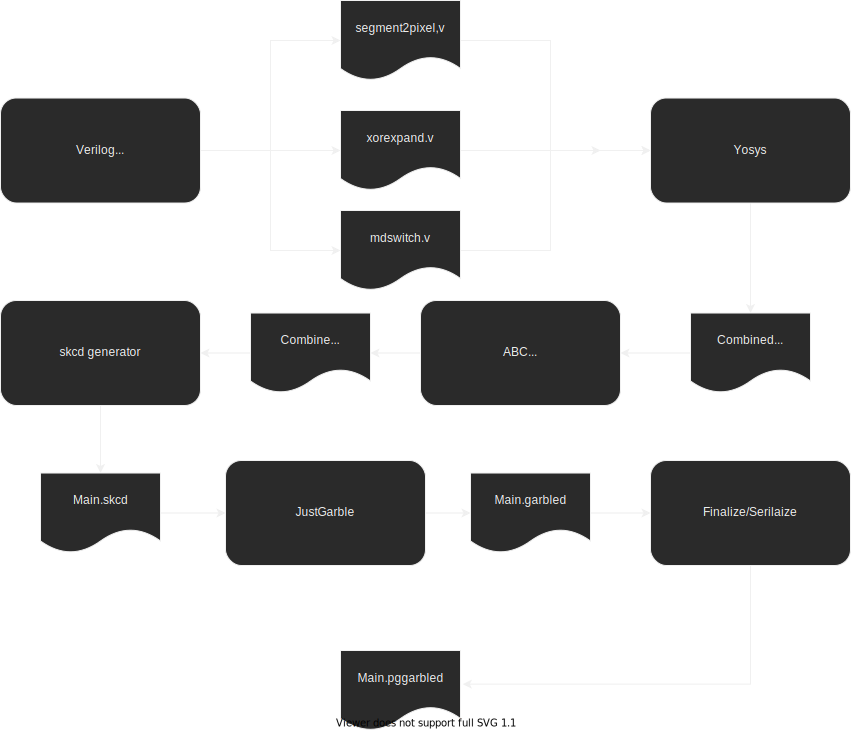

# Detailed Pipeline for Display Circuits

## Pipeline

Overview : 

[1] Generate “segment2pixel.v” using internal code [using e.g. 7segs.png]

[2] Verilog  → .blif : combine all Verilog(xorexpand+rndswitch+segment2pixel) using Yosys

[3] .blif → .blif.blif : optimization /synthesis : using ABC

[4] Parsing .blif → .skcd : using internal code

[5] Garbling .skcd → .garbled : using JustGarble

[6] Finalize/Serialize .garbled → .pgarbled : Using internal code; allows for parallel eval of a Garbled Circuit

NOTE: the file types are mentioned for clarity and to allow matching with calling the executables (e.g. Yosys or ABC) manually, but in practice after [2] all is done in memory, and cached.




### [1] Generate “segment2pixel.v”

Note : this is the only file in the pipeline that needs to be regenerated when changing size/resolution. The rest (xorexpand+rndswitch+segment2pixel) are static, and the size/resolution is handled by passing the appropriate “`define” to Yosys.
	This allows to cache the resulting .skcd of the whole pipeline (cf CircuitDisplayGenerator::GenerateDisplay) using “segment2pixel.v” content as cache key.

TODO clarify
7segs.png (or other) is parsed from an embedded resource into the executable, and prepared for later use (and some pre-computation is done based on the colors of the .png)
???
CircuitDisplayGenerator::GenerateSegmentToPixelVerilog 
A “bitmap” is generated with the correct number of digits at the correct positions [in relative coords]
E.g. 2-4 digits in the center of the “message window”, and 10 digits vertically oriented for the “pinpad window”
If there is an in-memory .skcd cached for this particular “segment2pixel.v” it is returned and that part is done	

### [2][3][4] Generate .skcd

If there is no cached .skcd for the step [1], one is generated cf CircuitDisplayGenerator::GenerateDisplay

The big steps are self-explanatory (pretty much just calling ABC or Yosys, and handling/parsing the results or errors; most of the business logic is in step [1]) :

```cpp
if (is_message) {
    YosysHelper::CompileVerilog(MESSAGE_SEGMENT2PIXELS_V,
                                MESSAGE_SEGMENT2PIXELS_V ".blif");
  } else {
    YosysHelper::CompileVerilog(PINPAD_SEGMENT2PIXELS_V,
                                PINPAD_SEGMENT2PIXELS_V ".blif");
  }

  GenerateDefineVerilog(is_message, msgsize, nb_segments, circuit_display_size);

  CompileVerilogHelpers(is_message);

  ConcatBlifs(is_message);

  RunAbc(is_message);

  // when segment2pixels cache is disabled, nothing to do, we can return
  if (!allow_cache) {
    return Blif2Skcd(is_message);
  }

  // segment2pixels enabled: we need to store the new entry into the SkcdCache
  Skcd skcd = Blif2Skcd(is_message);
  skcd_cache_->Set(hash_segment2pixels, skcd);
  return skcd;

```


### [5][6] Garbling

Technically garbling + “stripping” (i.e. generating the “pre-packmsg”).
This is at this step that the pinpad/OTP randomness is introduced, i.e. the .skcd generated at the previous step CAN/SHOULD be reused (and it is) all the time (i.e. it is always reused, except when changing size or resolution).

In production, the “stripped circuits” are what is sent to a device ahead of time and the “pre-packmsg” is stored in the DB.
Then when creating a transaction, the “pre-packmsg” is used to generate the correct “packmsg” with the desired transaction  message (e.g. “Do you authorize sending X BTC to Y address”), and then send it to the Device.
The Device then combines the “packmsg” and the “stripped circuits” and proceed to evaluate the circuits (= generating the final bitmap, one for each frame at the target 60+ FPS).

TODO if we stop sending the circuits ahead of time (i.e. the generation is fast enough, and the size small enough to be able to get them on the spot even on a mobile), we COULD probably remove the whole “2 steps” concept of stripped circuits + packmsg. There is indeed no point in sending both the packmsg and the stripped circuit in the same payload.


## Circuit Pipeline API

Implemented with GRPC because why not?
With a gateway (TODO Envoy or gprc-gateway?)
Gateway needed because there is no no_std HTTP2 client in Rust
There are indeed a few no_std Protobuf libs out there(eg https://github.com/tokio-rs/prost/blob/978fb03f05f9927b43d6d402044f9fb41a9addb3/README.md#using-prost-in-a-no_std-crate and https://github.com/tafia/quick-protobuf), but this is only half the required parts.

Why an API instead of directly calling lib_server from Rust in the OCW ?
Because lib_server is GPL, and we don’t really want to contaminate everything with GPL
Because there is no (easy) way to call something as big as lib_server in a no_std context anyway
[and because the OCW will need to read/write in a DB/IPFS and there is probably no easy way to do that in a no_std context]
