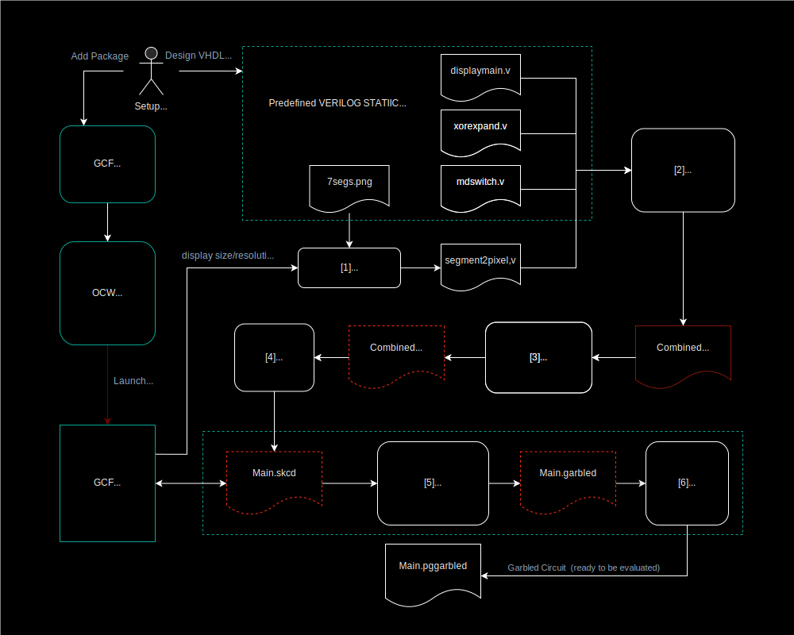

# Detailed Pipeline for Display Circuits Production

This is the Garbled Circuits generation detailed pipeline for the Transaction/Sensitive operation Validation screen use case.

It illustrates the way Garbled Circuit Factory works with substrate ocw palets:
 - `ocw-circuit`: logic circuit generation
 - `ocw-garble` : garble circuit generation 
 


## Pipeline


>The file types are mentioned for clarity and to allow matching with calling the executables (e.g. Yosys or ABC) manually, but in practice after [2] all is done in memory, and cached.


**On the following schema, cached files are represented with red doted line**





Overview : 

`[1] Generate~` “segment2pixel.v” using internal code [using e.g. 7segs.png]

` [2] Verilog  → .blif `: combine/synth all Verilog modules i.e. display-main+LFSR_comb+BitCounter+rndswitch+segment2pixel using Yosys (update Phase 2 M2)

`[3] .blif → .blif.blif `: optimization /synthesis : using ABC

`[4] Parsing .blif → .skcd `: using internal code

`[5] Garbling .skcd → .garbled`: using New Garbling scheme (update Phase 2 M1)

`[6] Finalize/Serialize .garbled → .pgarbled`: Using internal code; allows for parallel evaluation of the Garbled Circuit


### [1] Generate “segment2pixel.v”

>This is the only file in the pipeline that needs to be regenerated when changing size/resolution. 
The rest (display-main.v, LFSR_comb.v, and rndswitch.v) are static, and the size/resolution is handled by passing the appropriate “`define” to Yosys.

This allows to cache the resulting .skcd of the whole pipeline (cf `CircuitPipeline::GenerateDisplaySkcd`) using `segment2pixel.v` **content as cache key**.


#### Segment2pixel use drawable functions to create the verilog circuit based on 7(x)segs.png (configuration file)
7segs.png (or other) is parsed from an embedded resource into the executable, and prepared for later use (and some pre-computation is done based on the colors of the .png)

>We can use other files like 14segs.png to handle segment based visual cryptography down the road

```cpp, editable
namespace drawable {

IDrawableSegmentedDigitRelCoordsLocal::IDrawableSegmentedDigitRelCoordsLocal(
    DigitSegmentsType segments_type)
    : segments_type_(segments_type),
      nb_segments_per_digit_(GetDigitSegmentsTypeNbSegments(segments_type_)) {}

DigitSegmentsType IDrawableSegmentedDigitRelCoordsLocal::GetType() const {
  return segments_type_;
}

uint32_t IDrawableSegmentedDigitRelCoordsLocal::GetNbSegments() const {
  return nb_segments_per_digit_;
}

template <typename DrawableWhereT>
Drawable<DrawableWhereT>::Drawable(
    DrawableWhereT&& where_to_draw,
    const IDrawableSegmentedDigitRelCoordsLocal& what_to_draw)
    : where_to_draw_(std::move(where_to_draw)), what_to_draw_(what_to_draw) {}

template <typename DrawableWhereT>
const IDrawableSegmentedDigitRelCoordsLocal& Drawable<DrawableWhereT>::What()
    const {
  return what_to_draw_;
}

template <typename DrawableWhereT>
const DrawableWhereT& Drawable<DrawableWhereT>::Where() const {
  return where_to_draw_;
}

/**
 * NOTE: try NOT to make this part too Verilog-specific because that way we can
 * write the output to a bitmap/png which is easier for dev/debug.
 * Technically this COULD directly return a map of some sort:
 * pixel(x1,y1) = segment0
 * pixel(x2,y2) = segment1
 * and assume the UNreturned pixel are background(ie NOT a SegmentID)
 */
template <typename DrawableWhereT>
std::vector<SegmentID> Draw(
    const std::vector<drawable::Drawable<DrawableWhereT>>& drawables,
    u_int32_t width, u_int32_t height) {
  std::vector<SegmentID> img_seg_ids;
  img_seg_ids.reserve(width * height);

  // CAREFUL: DO NOT switch the order else the final garbled outputs will be
  // rotated 90 degrees. Not a catastrophe but not ideal.
  for (uint32_t y = 0; y < height; ++y) {
    for (uint32_t x = 0; x < width; ++x) {
      drawable::Point2DRelative rel_coords_world(
          static_cast<float>(x) / static_cast<float>(width),
          static_cast<float>(y) / static_cast<float>(height));

      // Find a drawable, if the rel_coords(ie the current pixel) is indeed on
      // one else it means it is background
      bool is_background = true;
      uint32_t offset_nb_segments = 0;
      for (const auto& drawable : drawables) {
        if (drawable.Where().IsInBBox(rel_coords_world)) {
          is_background = false;

          auto rel_coords_local =
              drawable.Where().GetRelCoordsLocalFromRelCoordsWorld(
                  rel_coords_world);
          auto local_seg_id = drawable.What().GetSegmentID(rel_coords_local);
          if (local_seg_id != -1) {
            // REALLY IMPORTANT
            // MUST convert the local_seg_id(eg usually 0-6 for 7 segs)
            // to a global one UNIQUE in the final bitmap
            img_seg_ids.emplace_back(
                SegmentID(offset_nb_segments + local_seg_id));
          } else {
            // background (in the current drawable)
            img_seg_ids.emplace_back(-1);
          }

          // we COULD overwrite with another Drawable in case of overlap but
          // what is the point; we might as well stop processing
          break;
        }

        offset_nb_segments += drawable.What().GetNbSegments();
      }

      // background (in the global bitmap)
      if (is_background) {
        img_seg_ids.emplace_back(-1);
      }
    }
  }

  assert(img_seg_ids.size() == width * height && "Draw: missing pixels!");
  return img_seg_ids;
}

// "explicit instantiation of all the types the template will be used with"
template class Drawable<RelativeBBox>;
template std::vector<SegmentID> Draw<RelativeBBox>(
    const std::vector<drawable::Drawable<RelativeBBox>>& drawables,
    u_int32_t width, u_int32_t height);

}  //   namespace drawable
````

`Segments2Pixels::Segments2Pixels`: [lib_circuits/src/segments2pixels/segments2pixels.cpp:137](https://github.com/Interstellar-Network/lib_circuits/blob/main/src/segments2pixels/segments2pixels.cpp)


```cpp,editable
namespace interstellar {

template <typename DrawableWhereT>
Segments2Pixels<DrawableWhereT>::Segments2Pixels(
    uint32_t width, uint32_t height,
    const std::vector<drawable::Drawable<DrawableWhereT>>& drawables)
    : width_(width), height_(height), drawables_(drawables) {
  uint32_t nb_digits = drawables_.size();

  // CHECK drawables MUST NOT be empty
  // We could return early instead of throwing but generating and then garbling
  // a circuit with no input does not really make sense.
  // Also it has never been tested so we would rather throw.
  if (drawables_.empty()) {
    throw std::logic_error("Segments2Pixels: drawables MUST NOT be empty");
  }

  // CHECK that all Drawable are the same class
  drawable::DigitSegmentsType segments_type = drawables_[0].What().GetType();
  uint32_t nb_segs_per_digit = drawables_[0].What().GetNbSegments();
  for (const auto& drawable : drawables_) {
    if (drawable.What().GetType() != segments_type) {
      throw std::logic_error(
          "Segments2Pixels: drawing different digits is not allowed");
    }
    nb_segments_ += drawable.What().GetNbSegments();
  }

  assert(nb_segments_ == nb_digits * nb_segs_per_digit &&
         "nb_segments mismatch!");

  // RNDSIZE
  // TODO Check
  // Historically(before the support of variable otp_length), message had
  // RNDSIZE=9, and pinpad RNDSIZE=16
  // math.ceil(0.5 * math.sqrt(8 * otp_length * message_seg + 1) + 1)
  auto rndsize = static_cast<unsigned int>(
      std::max(std::ceil(0.5 * std::sqrt(8 * nb_segments_ + 1) + 1), 9.));
  config_ = {{"WIDTH", width_},
             {"HEIGHT", height_},
             {"BITMAP_NB_SEGMENTS", nb_segments_},
             {"RNDSIZE", rndsize},
             {"NB_DIGITS", nb_digits},
             {"NB_SEGS_PER_DIGIT", nb_segs_per_digit},
             {"SEGMENTS_TYPE", static_cast<uint32_t>(segments_type)}};
}
```

Then `segment2pixel.v` VHDL file is generated:

`Segments2Pixels::GenerateVerilog`: [ lib_circuits/src/segments2pixels/segments2pixels.cpp:232](https://github.com/Interstellar-Network/lib_circuits/blob/main/src/segments2pixels/segments2pixels.cpp#L137)

A “bitmap” is generated with the correct number of digits at the correct positions [in relative coords]
E.g. 2-4 digits in the center of the “message window”, and 10 digits vertically oriented for the “pinpad window”
If there is an in-memory .skcd cached for this particular “segment2pixel.v” it is returned and that part is done

```cpp,editable
template <typename DrawableWhereT>
std::string Segments2Pixels<DrawableWhereT>::GenerateVerilog() const {
  // Generate the complete bitmap, then compute the SegmentID for each pixel
  // Previously it was done is the ctor then stored in class member but it is
  // only used here so no point in doing that
  std::vector<drawable::SegmentID> bitmap_seg_ids =
      Draw(drawables_, width_, height_);

  std::vector<utils::RLE_int8_t> bitmap_seg_ids_rle =
      utils::compress_rle(bitmap_seg_ids);

  std::string verilog_buf;
  unsigned int nb_inputs = nb_segments_ - 1,
               nb_outputs = (width_ * height_) - 1;

  // without reserve : 1657472 - 1771623 (ns)
  // with reserve : 1250652 - 1356733 (ns)
  // Now in the .v, ranges are encoded as eg: assign p[75295:75287] = 0;
  // So we really do not need much memory.
  unsigned int nb_pixels = width_ * height_;
  size_t size_to_reserve =
      ((nb_pixels * strlen("assign p[000000] = s[0000];\n")) / 5) + 1000;
  verilog_buf.reserve(size_to_reserve);

  verilog_buf += "// module to convert segments into an image bitmap\n";
  verilog_buf +=
      "// generated by lib_circuits/src/segments2pixels/segments2pixels.cpp\n";
  verilog_buf += "// (c) Interstellar\n\n";

  verilog_buf += "module segment2pixel(s, p);  // convert segments to pixels\n";
  // TODO
  verilog_buf +=
      fmt::format("input [{:d}:0] s; // segments to display\n", nb_inputs);
  verilog_buf +=
      fmt::format("output [{:d}:0] p;  // pixels output\n", nb_outputs);

  // TODO use absl or fmtlib
  size_t pixels_counter = 0;
  for (const auto& it : bitmap_seg_ids_rle) {
    // NOTE: bitmap_seg_ids_rle is RLE encoded
    // - OFF segment(seg_id==-1):   "assign p[7680:0] = 0;"
    // - ON segment(eg seg_id=16):  "assign p[17855:17854] = s[16];"
    auto seg_id = it.value;
    auto len = it.size;
    if (seg_id == -1) {
      // NOTE: range inverted! written as eg [7680:0] not [0:7680]
      verilog_buf += "assign p[";
      verilog_buf += fmt::format_int(pixels_counter + len - 1).str();
      verilog_buf += ":";
      verilog_buf += fmt::format_int(pixels_counter).str();
      verilog_buf += "] = ";
      verilog_buf += "0;\n";
    } else {
      // When a valid seg_id, we CAN NOT write eg "assign p[7456:7412] = s[14];"
      // This is NOT valid verilog, apparently
      // verilator --lint-only: "Operator ASSIGNW expects 47 bits on the Assign
      // RHS, but Assign RHS's SEL generates 1 bits."
      for (uint32_t j = pixels_counter; j < pixels_counter + len; ++j) {
        verilog_buf += "assign p[";
        verilog_buf += fmt::format_int(j).str();
        verilog_buf += "] = ";
        verilog_buf += "s[";
        verilog_buf += fmt::format_int(seg_id).str();
        verilog_buf += "];\n";
      }
    }
    pixels_counter += len;
  }

  verilog_buf += "endmodule";

  return verilog_buf;
}

/**
 * display-main.v and others expect eg:
 *
  `define WIDTH 56
  `define HEIGHT 24
  `define RNDSIZE 9
  `define BITMAP_NB_SEGMENTS 28
 */
template <typename DrawableWhereT>
std::string Segments2Pixels<DrawableWhereT>::GetDefines() const {
  auto verilog_defines = verilog::Defines();
  // NOTE: probably NOT all the config keys are needed on the Verilog side
  for (auto const& [key, val] : config_) {
    verilog_defines.AddDefine(key, val);
  }

  return verilog_defines.GetDefinesVerilog();
}

/**
 * We could DRY with GetDefines but most of the keys in config are NOT needed on
 * the Verilog side.
 */
template <typename DrawableWhereT>
const absl::flat_hash_map<std::string, uint32_t>&
Segments2Pixels<DrawableWhereT>::GetConfig() const {
  return config_;
}

// "explicit instantiation of all the types the template will be used with"
template class Segments2Pixels<drawable::RelativeBBox>;

}  // namespace interstellar
```

### [2][3][4] Generate .skcd

The big steps are self-explanatory (pretty much just calling ABC or Yosys, and handling/parsing the results or errors; most of the business logic is in step [1]) :

`CircuitPipeline::GenerateSkcd`: [lib_circuits/src/circuit_lib.cpp:19](https://github.com/Interstellar-Network/lib_circuits/blob/main/src/circuit_lib.cpp#L19)

```cpp, editable
amespace interstellar {

namespace circuits {

// TODO how to handle InitGoogleLogging ?

void GenerateSkcd(boost::filesystem::path skcd_output_path,
                  const std::vector<std::string_view> &verilog_inputs_paths,
                  const utils::TempDir &tmp_dir) {
  auto blif_parser = GenerateBlifBlif(verilog_inputs_paths, tmp_dir);

  interstellar::skcd::WriteToFile(skcd_output_path, blif_parser);
}

std::string GenerateSkcd(
    const std::vector<std::string_view> &verilog_inputs_paths,
    const utils::TempDir &tmp_dir,
    absl::flat_hash_map<std::string, uint32_t> &&config) {
  auto blif_parser =
      GenerateBlifBlif(verilog_inputs_paths, tmp_dir, std::move(config));

  return interstellar::skcd::Serialize(blif_parser);
}

/**
 * [internal]
 */
void GenerateSkcd(boost::filesystem::path skcd_output_path,
                  const std::vector<std::string_view> &verilog_inputs_paths) {
  auto tmp_dir = utils::TempDir();
  auto blif_parser = GenerateBlifBlif(verilog_inputs_paths, tmp_dir);

  interstellar::skcd::WriteToFile(skcd_output_path, blif_parser);
}

/**
 * [internal]
 */
std::string GenerateSkcd(
    const std::vector<std::string_view> &verilog_inputs_paths,
    absl::flat_hash_map<std::string, uint32_t> &&config) {
  auto tmp_dir = utils::TempDir();
  auto blif_parser =
      GenerateBlifBlif(verilog_inputs_paths, tmp_dir, std::move(config));

  return interstellar::skcd::Serialize(blif_parser);
}

/**
 * IMPORTANT: used by api_circuits
 */
std::string GenerateSkcd(
    const std::vector<std::string_view> &verilog_inputs_paths) {
  auto tmp_dir = utils::TempDir();
  auto blif_parser = GenerateBlifBlif(verilog_inputs_paths, tmp_dir);

  return interstellar::skcd::Serialize(blif_parser);
}

```

If there is no cached .skcd for the step [1], one is generated with 
`CircuitPipeline::GenerateDisplaySkcd`: [lib_circuits/src/circuit_lib.cpp:56](https://github.com/Interstellar-Network/lib_circuits/blob/main/src/circuit_lib.cpp#L56)

```cpp, editable
void GenerateDisplaySkcd(
    boost::filesystem::path skcd_output_path, u_int32_t width, u_int32_t height,
    circuits::DisplayDigitType digit_type,
    std::vector<std::tuple<float, float, float, float>> &&digits_bboxes) {
  auto result_skcd_buf =
      GenerateDisplaySkcd(width, height, digit_type, std::move(digits_bboxes));

  utils::WriteToFile(skcd_output_path, result_skcd_buf);
}

std::string GenerateDisplaySkcd(
    u_int32_t width, u_int32_t height, DisplayDigitType digit_type,
    std::vector<std::tuple<float, float, float, float>> &&digits_bboxes) {
  auto tmp_dir = utils::TempDir();

  const auto &what_to_draw = GetDrawableFromDigitType(digit_type);
  std::vector<drawable::Drawable<drawable::RelativeBBox>> drawables;
  for (auto &&digit_bbox : digits_bboxes) {
    drawables.emplace_back(
        drawable::RelativeBBox(std::get<0>(digit_bbox), std::get<1>(digit_bbox),
                               std::get<2>(digit_bbox),
                               std::get<3>(digit_bbox)),
        what_to_draw);
  }

  // [1] generate Verilog segments2pixels.v
  auto segments2pixels = Segments2Pixels(width, height, drawables);
  auto segments2pixels_v_str = segments2pixels.GenerateVerilog();
  auto config = segments2pixels.GetConfig();

  // write this to segments2pixels.v (in the temp dir)
  // because Yosys only handles files, not buffers
  auto segments2pixels_v_path = tmp_dir.GetPath() / "segments2pixels.v";
  utils::WriteToFile(segments2pixels_v_path, segments2pixels_v_str);

  auto defines_v_str = segments2pixels.GetDefines();
  // write this to defines.v (in the temp dir)
  // because Yosys only handles files, not buffers
  auto defines_v_path = tmp_dir.GetPath() / "defines.v";
  utils::WriteToFile(defines_v_path, defines_v_str);

  std::string result_skcd_buf = GenerateSkcd(
      {
          defines_v_path.generic_string(),
          segments2pixels_v_path.generic_string(),
          absl::StrCat(interstellar::data_dir, "/verilog/rndswitch.v"),
          absl::StrCat(interstellar::data_dir, "/verilog/xorexpand.v"),
          absl::StrCat(interstellar::data_dir, "/verilog/display-main.v"),
      },
      std::move(config));

  return result_skcd_buf;
}

}  // namespace circuits
```  

### [5][6] Garbling (updated for Phase 2/M1)

Pretty straitforward calls to [lib_garble.rs](https://github.com/Interstellar-Network/lib-garble-rs/tree/w3f-phase2-milestone1) library in Integritee (TEE protected pallet)

including call to  `garble_internal`: [garbled internal](https://github.com/Interstellar-Network/lib-garble-rs/blob/w3f-phase2-milestone1/lib-garble-rs/src/new_garbling_scheme/garble.rs#L221)


Deprecated - usage of JustGarble:
`ParallelGarbledCircuit GarbleSkcd`: [lib_garble/src/justgarble/garble_helper.cpp:16](https://github.com/Interstellar-Network/lib_garble/blob/main/src/parallel_garbled_circuit/parallel_garbled_circuit.cpp)


## Circuit Pipeline API

We have chosen a  gRPC implementation mainly because  there is no no_std HTTP2 client in Rust, although there is a no_std Protobuf libs out there [in the tokio framework](https://github.com/tokio-rs/prost/blob/978fb03f05f9927b43d6d402044f9fb41a9addb3/README.md#using-prost-in-a-no_std-crate) 
and we use tokio/tonic also compliant with HTTP1 to comunicate with OCWs

