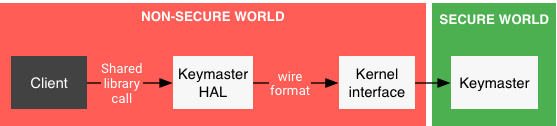

# Hardware-backed Mobile Key

## Hardware Keystore

[Hardware-backed Keystore](https://source.android.com/security/keystore)

## Attestation management

[Key and ID Attestation | Android Open Source Project](https://source.android.com/security/keystore/attestation)
Verifying hardware-backed key pairs with Key Attestation

[How to check whether Android phone supports TEE](https://stackoverflow.com/questions/61225795/how-to-check-whether-android-phone-supports-tee/64422042#64422042)