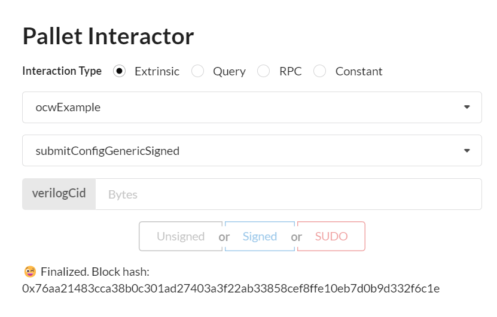
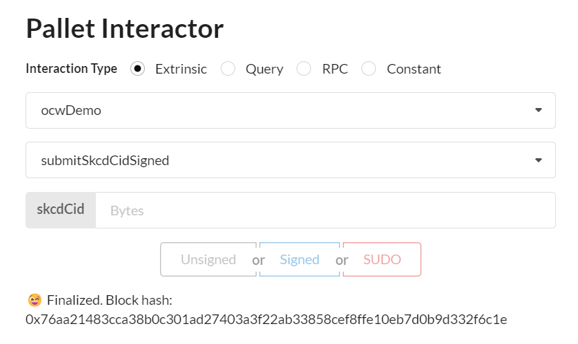

# M1 Docker Demo Tutorial

## Set-up Demo
### Launch ipfs deamon

```sh
GO_IPFS_PATH=/usr/local/bin/ipfs

IPFS_PATH=/tmp/ipfs $GO_IPFS_PATH init -p test
IPFS_PATH=/tmp/ipfs $GO_IPFS_PATH config Addresses.API /ip4/0.0.0.0/tcp/5001
```
```
IPFS_PATH=/tmp/ipfs $GO_IPFS_PATH daemon --enable-pubsub-experiment
```

```sh
Initializing daemon...
go-ipfs version: 0.11.0
Repo version: 11
System version: amd64/linux
Golang version: go1.16.12
Swarm listening on /ip4/127.0.0.1/tcp/46507
Swarm listening on /p2p-circuit
Swarm announcing /ip4/127.0.0.1/tcp/46507
API server listening on /ip4/0.0.0.0/tcp/5001
WebUI: http://0.0.0.0:5001/webui
Gateway (readonly) server listening on /ip4/127.0.0.1/tcp/38297
Daemon is ready
```


### Launch dockers:

#### Launch api_circuit docker

```sh
docker run -it --name api_circuits --rm -p 3000:3000 --env RUST_LOG="warn,info,debug" ghcr.io/interstellar-network/api_circuits:milestone1 /usr/local/bin/api_circuits --ipfs-server-multiaddr /ip4/172.17.0.1/tcp/5001
```


#### Launch api_garble docker

```sh
docker run -it --name api_garble --rm -p 3001:3000 --env RUST_LOG="warn,info,debug" ghcr.io/interstellar-network/api_garble:milestone1 /usr/local/bin/api_garble --ipfs-server-multiaddr /ip4/172.17.0.1/tcp/5001
```


### Launch substrate demo chain with OCW


```sh
RUST_LOG="warn,info" cargo run -- --dev --tmp
```
> Important: the node log will display some results i.e cid that you will have to copy paste to perform the demo


### Launch a generic Substrate Fromt-end

```sh
Yarn start
```


## Demo overview

> To avoid any ambiguities regarding the state of the pallet (for demo/eample purpose only - not production ready)

We named the two OCW pallets we interact with:

- ocwExample (to manage configuration/generation of logical circuit file)
- ocwDemo (to manage garbled circuit production)


### 1. write a verilog master/config file.v in IPFS and get its `VerilogCid`
`GCF: can be set-up` for production **with verilog master file**

### 2. signed extrinsic with `VerilogCid` of master File/config file.v to `ocwExample` pallet
`Request->GCF`: **OCW launch  the generation of the logical circuit file in GCF**

`Response<-GCF`: **OCW get the  `skcdCid` of the generated logical circui (.skcd)**

`GCF: GC production ready` for the production of Garbled Circuits: 
**OCW is configured with verilog master file**

>skcd file is cached in the production pipeline

### 3. signed extrinsic with `skcdCid` to `ocwDemo` pallet
`Request->GCF`: **OCW launch  the generation garbled circuit file(s) in GCF**

`Response<-GCF`: **OCW get the `gcCid` of the generated Garbled Circuit (ready to be evaluated)**


## Step 1: Upload Master/Config verilog (.v) file/ write in IPFS


```sh
curl -X POST -F file=@/REPLACEME/PATH/verilogFileExample.v "http://127.0.0.1:5001/api/v0/add?progress=true"
```
> Get the VerilogCid to use with pallet interactor

Files example to add:
very simple adder circuit

adder.v
```verilog,editable
// https://www.geeksforgeeks.org/full-adder-using-verilog-hdl/

// Code your design : Full Adder
module full_add(a,b,cin,sum,cout);
  input a,b,cin;
  output sum,cout;
  wire x,y,z;

// instantiate building blocks of full adder
  half_add h1(.a(a),.b(b),.s(x),.c(y));
  half_add h2(.a(x),.b(cin),.s(sum),.c(z));
  or o1(cout,y,z);
endmodule : full_add

// code your half adder design
module half_add(a,b,s,c);
  input a,b;
  output s,c;

// gate level design of half adder
  xor x1(s,a,b);
  and a1(c,a,b);
endmodule :half_add
```

## Interact with Substrate Front End

We use Pallet Interactor to pilot the configuration and generation management of the circuits with GCF


## Step 2: Submit `VerilogCid` with pallet Interactor

#### 2.1 Go to `ocwExample` pallet and  and input the `VerilogCid` you got at step 1.

We use this pallet to submit the master file config file example.



GCF will generate the logical_file.skcd store it in IPFS and send  back skcdCid to the pallet.

#### 2.2 copy paste the skcdCid that appear in the log of the node ([example] Hello from pallet-ocw)
```sh
2022-03-11 18:38:35 💤 Idle (0 peers), best: #12141 (0x61dd…ab06), finalized #12139 (0xe4bf…9f35), ⬇ 0 ⬆ 0    
2022-03-11 18:38:36 🙌 Starting consensus session on top of parent 0x61dd629bedb966389196018cf2cafacd9d529ec26d304545b283454e6d2dab06    
2022-03-11 18:38:36 🎁 Prepared block for proposing at 12142 [hash: 0xa463c744bce8948476af640d07031460646d1b48c8823e5ba4618da5be72175b; parent_hash: 0x61dd…ab06; extrinsics (1): [0x3f1f…b797]]    
2022-03-11 18:38:36 🔖 Pre-sealed block for proposal at 12142. Hash now 0xa72ffa4ced99481ebeeae2a14668ac719669d694a1e5fcfbf6a68fd64b909501, previously 0xa463c744bce8948476af640d07031460646d1b48c8823e5ba4618da5be72175b.    
2022-03-11 18:38:36 ✨ Imported #12142 (0xa72f…9501)    
2022-03-11 18:38:36 [example] Hello from pallet-ocw.    
2022-03-11 18:38:36 [example] sending body b64: AAAAADAKLlFtWExtUWJwZkRkWjRZc0ZBS2tzOXFQcUtiNVRaWlN3VG81RTd6SHhqUTFBNUc=    
2022-03-11 18:38:36 [example] status code: 200    
2022-03-11 18:38:36 [example] header: content-type application/grpc-web+proto    
2022-03-11 18:38:36 [example] header: transfer-encoding chunked    
2022-03-11 18:38:36 [example] header: date Fri, 11 Mar 2022 17:38:36 GMT    
2022-03-11 18:38:36 [example] Got gRPC trailers: grpc-status:0
    
2022-03-11 18:38:36 [example] Got IPFS hash: QmZ9UJbraZTjnkCYy7FTZWDaiv2s6qWTzfFNhFLgHJRfuh    
2022-03-11 18:38:36 [example] fetch_n_parse: QmZ9UJbraZTjnkCYy7FTZWDaiv2s6qWTzfFNhFLgHJRfuh    
2022-03-11 18:38:36 [example] FINAL got result IPFS hash : [b8, 51, 6d, 5a, 39, 55, 4a, 62, 72, 61, 5a, 54, 6a, 6e, 6b, 43, 59, 79, 37, 46, 54, 5a, 57, 44, 61, 69, 76, 32, 73, 36, 71, 57, 54, 7a, 66, 46, 4e, 68, 46, 4c, 67, 48, 4a, 52, 66, 75, 68] 
```
## Step 3: Submit `skcdCid` with  pallet Interactor

we use this pallet to submit the cid of the logical_file.skcd

#### 3.1 Go to `ocwDemo` pallet and input the `skcdCid` you got at step 2.2




### Step 3.2 Garbled Circuit cid appear in node log ([ocw] Hello from pallet-ocw)
```sh   
2022-03-11 18:38:36 [ocw] Hello from pallet-ocw.    
2022-03-11 18:38:36 [ocw] encode_body2: [51, 6d, 5a, 39, 55, 4a, 62, 72, 61, 5a, 54, 6a, 6e, 6b, 43, 59, 79, 37, 46, 54, 5a, 57, 44, 61, 69, 76, 32, 73, 36, 71, 57, 54, 7a, 66, 46, 4e, 68, 46, 4c, 67, 48, 4a, 52, 66, 75, 68]    
2022-03-11 18:38:36 [ocw] sending body b64: AAAAADAKLlFtWjlVSmJyYVpUam5rQ1l5N0ZUWldEYWl2MnM2cVdUemZGTmhGTGdISlJmdWg=    
2022-03-11 18:38:36 [ocw] status code: 200    
2022-03-11 18:38:36 [ocw] header: content-type application/grpc-web+proto    
2022-03-11 18:38:36 [ocw] header: transfer-encoding chunked    
2022-03-11 18:38:36 [ocw] header: date Fri, 11 Mar 2022 17:38:36 GMT    
2022-03-11 18:38:36 [ocw] Got gRPC trailers: grpc-status:0
    
2022-03-11 18:38:36 [ocw] Got IPFS hash: QmPUDRnaJG6wp22hMALAWKpyAwTZDts3vCZJmHZWWkXZJj    
2022-03-11 18:38:36 [ocw] fetch_n_parse: QmPUDRnaJG6wp22hMALAWKpyAwTZDts3vCZJmHZWWkXZJj    
2022-03-11 18:38:36 [ocw] FINAL got result IPFS hash : [b8, 51, 6d, 50, 55, 44, 52, 6e, 61, 4a, 47, 36, 77, 70, 32, 32, 68, 4d, 41, 4c, 41, 57, 4b, 70, 79, 41, 77, 54, 5a, 44, 74, 73, 33, 76, 43, 5a, 4a, 6d, 48, 5a, 57, 57, 6b, 58, 5a, 4a, 6a]   
```


