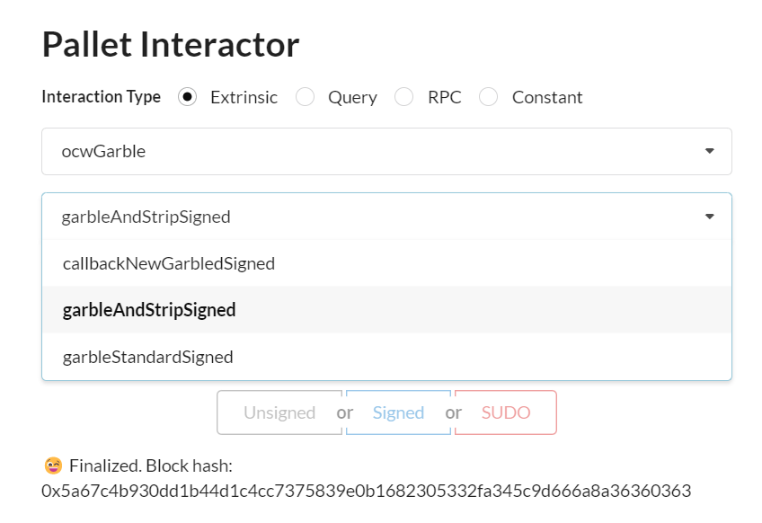
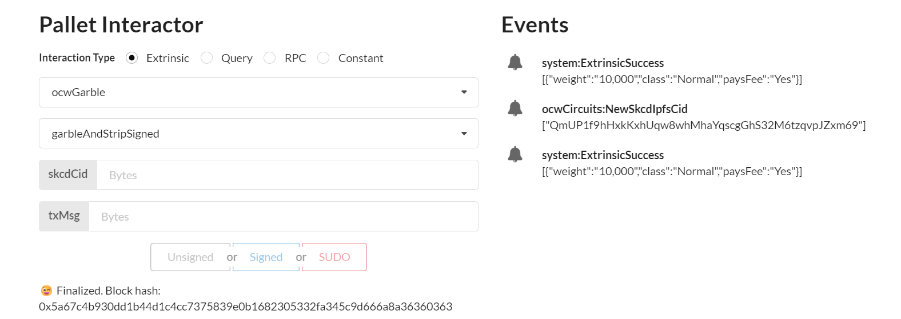
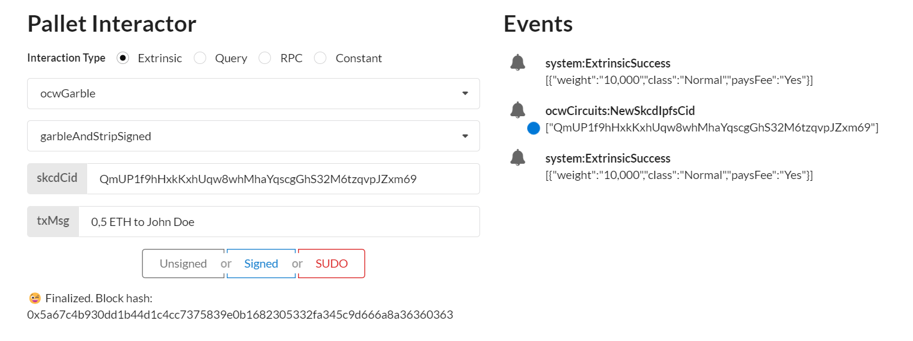
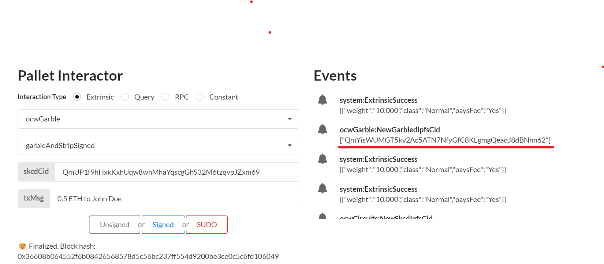
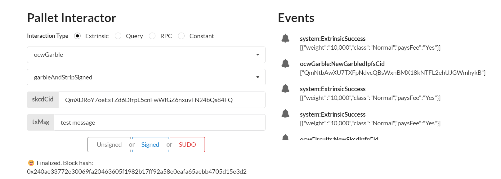

# M2 Docker Demo Tutorial 


## Check prerquiste

[runtime prerequiste](./runtime_prerequisite.md)


## Set-up Demo
### Launch ipfs deamon

```sh
GO_IPFS_PATH=/usr/local/bin/ipfs
```
```sh
IPFS_PATH=/tmp/ipfs $GO_IPFS_PATH init -p test
```
```sh
IPFS_PATH=/tmp/ipfs $GO_IPFS_PATH config Addresses.API /ip4/0.0.0.0/tcp/5001
```
```sh
IPFS_PATH=/tmp/ipfs $GO_IPFS_PATH daemon --enable-pubsub-experiment
```

```sh
Initializing daemon...
go-ipfs version: 0.11.0
Repo version: 11
System version: amd64/linux
Golang version: go1.16.12
Swarm listening on /ip4/127.0.0.1/tcp/46507
Swarm listening on /p2p-circuit
Swarm announcing /ip4/127.0.0.1/tcp/46507
API server listening on /ip4/0.0.0.0/tcp/5001
WebUI: http://0.0.0.0:5001/webui
Gateway (readonly) server listening on /ip4/127.0.0.1/tcp/38297
Daemon is ready
```


### Launch dockers:

#### Launch api_circuit docker

```sh
docker run -it --name api_circuits --rm -p 3000:3000 --env RUST_LOG="warn,info,debug" ghcr.io/interstellar-network/api_circuits:milestone2 /usr/local/bin/api_circuits --ipfs-server-multiaddr /ip4/172.17.0.1/tcp/5001
```


#### Launch api_garble docker

```sh
docker run -it --name api_garble --rm -p 3001:3000 --env RUST_LOG="warn,info,debug" ghcr.io/interstellar-network/api_garble:milestone2 /usr/local/bin/api_garble --ipfs-server-multiaddr /ip4/172.17.0.1/tcp/5001
```


### Launch substrate demo chain with OCW


```
git clone --branch=main --recursive git@github.com:Interstellar-Network/substrate-offchain-worker-demo.git
```
then
```
cd substrate-offchain-worker-demo 
````


build the substrate chain....

```sh
RUST_LOG="warn,info" cargo run -- --dev --tmp --enable-offchain-indexing=1
```
> IMPORTANT: you MUST use --enable-offchain-indexing=1 else it will always do nothing and show "[ocw-garble] nothing to do, returning..." and "[ocw-circuits] nothing to do, returning..." in the logs


### Launch a generic Substrate Fromt-end

Use the following [substrate link](https://substrate-developer-hub.github.io/substrate-front-end-template/?rpc=ws%3A%2F%2Flocalhost%3A9944) to launch substrate front end

to connect to a locally running node

> avoid some browser extensions that could generate interface issues

## Demo purpose and used components


In this demo, we want to demonstrate how:

- ocwCircuits and ocwGarble pallets can manage the production of the display garbled circuits 
- the Transaction Validation Protocol TTVP pallet can confirm the transactions based on those circuit evaluations/executions

`ocwCircuits`: can manage the generation of the logical display circuit in `skcd format` to configure the garbled circuit production.
> the generation of this configuartion display circuit uses a Master File VHDL packages (pre-configured for that demo).

 `ocwGarble`: can generate for each transaction a randomized display garbled circuit (with random Keypad and one time code) with a customized message based on transaction parameters

`GCevaluator`: evaluates the garbled circuit/display message and get the one time code to verify

`TTVP`: checks that the one time code is correct


## Demo overview:

### 1. Generate with `ocwCircuits` pallet the configuration display circuit 
> This step will generate a logical circuit in skcd format cached in memory in the production pipeline


### 2. Generate with `ocwGarble` pallet a randomized display garble circuit 

> This step will use skcd cached file and input parameter to generate a randomized garbled circuit customized with transaction parameter
> in this demo we do not use yet, other circuit customization parameters like screen resolution, etc..


### 3. Evaluation of the display garbled circuit with `GCevaluator`and get One time code

### 4. Check one time code with `TTVP pallet`


# Start Demo

> IMPORTANT: when intracting with pallets you MUST use the Signed button in blue to sign all the transactions, not SUDO, neither Unsigned

> step 1,2 & 4 use pallet interactor in the Substrate Front End

## 1. Generate with `ocwCircuits` the configuration display circuit 

### 1.1  Select ocwCircuits pallet and submitConfigDisplaySigned extrinsic


### 1.2 Sign transaction


### 1.3 Copy the ipfs hash/cid of the generated skcd file 

> the cid appears in Events (blue dot on this screenshot example)


## 2. Generate with `ocwGarble` a randomized display garble circuit 

this circuit can display a transaction message with one time code and a random keypad


### 2.1 Select ocwGarble pallet and garbleAndStripSigned extrinsic




### 2.2 Input skcdCid and Transaction message



#### 2.2.1 Paste the ipfs hash/cid of step 1.3 in field skcdCid


#### 2.2.2 Input the message in field txMsg




> the skcd cid is still in Events, blue dot in this example
#### 2.2.3 Sign the transaction

#### 2.2.4 2 garbled circuit cids appear in Events



> the 2 generated garbled circuit cids `NewGarbledIpfsCid`will then appear in Events (underlined in red line in this screenshot example)


### 2.3 Copy paste the hashs of the 2 generated display garbled circuit (ready to be avaluated)


> first one is used to generate pgarble

> second one is used to generate packmsg (ie)


> coment: You can specify any type of transaction message
not especially tied to a wallet transaction
It can be used for any sensitive operation that need a highly secure confirmtion




## 3. Evaluation of the display garbled circuit with `GCevaluator` to get the One time code to validate


```sh
IPFS_PATH=/tmp/ipfs $GO_IPFS_PATH cat QmX9TgCtnAadSu1YDmut4DDfdYeRg3XWnoU4Tmg5mswRs8 > pgarbled.pb.bin


IPFS_PATH=/tmp/ipfs $GO_IPFS_PATH cat QmVHn9RZLHziVf1XGuUNNNLm23XgU5VgxSBR8tCVqQj9WH> packmsg.pb.bin


./tests/cli_eval_stripped --pgarbled_input_path=pgarbled.pb.bin --packmsg_input_path=packmsg.pb.bin


if the docker host can use X11: 

```sh
docker run -it --rm -v $(pwd):/data/ -v /tmp/.X11-unix:/tmp/.X11-unix -e DISPLAY=$DISPLAY ghcr.io/interstellar-network/lib_garble:milestone2 --pgarbled_input_path=/data/pgarbled.pb.bin --packmsg_input_path=/data/packmsg.pb.bin
````

else: 

```sh
docker run -it --rm -v $(pwd):/data/ ghcr.io/interstellar-network/lib_garble:milestone2 --pgarbled_input_path=/data/pgarbled.pb.bin --packmsg_input_path=/data/packmsg.pb.bin --png_output_path=/data/output_eval.png
```

> $(pwd)/data path must match ipfs cat cmd

## 4. Check one time code with `TTVP pallet`
