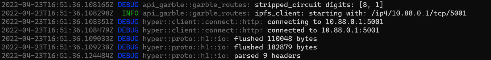
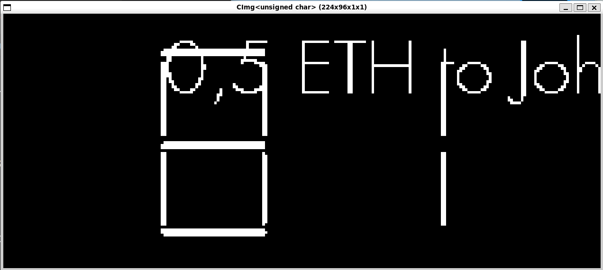
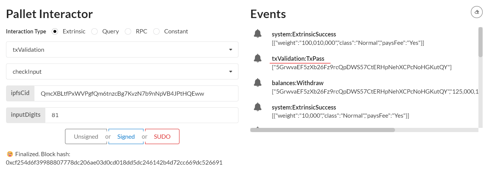
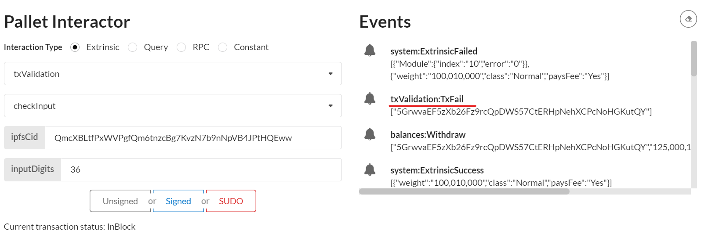

# M2 Docker Demo Tutorial 


## Check prerequiste

[runtime prerequiste](./runtime_prerequisite.md)


## Set-up Demo
### Launch ipfs deamon

```sh
export GO_IPFS_PATH=/usr/local/bin/ipfs
```
```sh
IPFS_PATH=/tmp/ipfs $GO_IPFS_PATH init -p test
```
```sh
IPFS_PATH=/tmp/ipfs $GO_IPFS_PATH config Addresses.API /ip4/0.0.0.0/tcp/5001
```
```sh
IPFS_PATH=/tmp/ipfs $GO_IPFS_PATH daemon --enable-pubsub-experiment
```

```sh
Initializing daemon...
go-ipfs version: 0.11.0
Repo version: 11
System version: amd64/linux
Golang version: go1.16.12
Swarm listening on /ip4/127.0.0.1/tcp/46507
Swarm listening on /p2p-circuit
Swarm announcing /ip4/127.0.0.1/tcp/46507
API server listening on /ip4/0.0.0.0/tcp/5001
WebUI: http://0.0.0.0:5001/webui
Gateway (readonly) server listening on /ip4/127.0.0.1/tcp/38297
Daemon is ready
```


### Launch dockers:

#### Launch api_circuit docker

```sh
docker run -it --name api_circuits --rm -p 3000:3000 --env RUST_LOG="warn,info,debug" ghcr.io/interstellar-network/api_circuits:milestone2 /usr/local/bin/api_circuits --ipfs-server-multiaddr /ip4/172.17.0.1/tcp/5001
```


#### Launch api_garble docker

```sh
docker run -it --name api_garble --rm -p 3001:3000 --env RUST_LOG="warn,info,debug" ghcr.io/interstellar-network/api_garble:milestone2 /usr/local/bin/api_garble --ipfs-server-multiaddr /ip4/172.17.0.1/tcp/5001
```


### Launch substrate demo chain with OCW


```
git clone --branch=master --recursive git@github.com:Interstellar-Network/substrate-offchain-worker-demo.git
```
then
```
cd substrate-offchain-worker-demo 
````


build and run the substrate chain....

```sh
RUST_LOG="warn,info" cargo run -- --dev --tmp --enable-offchain-indexing=1
```
> IMPORTANT: you MUST use --enable-offchain-indexing=1 else it will always do nothing and show "[ocw-garble] nothing to do, returning..." and "[ocw-circuits] nothing to do, returning..." in the logs


### Launch a generic Substrate Fromt-end

Use the following [substrate link](https://substrate-developer-hub.github.io/substrate-front-end-template/?rpc=ws%3A%2F%2Flocalhost%3A9944) to launch substrate front end

to connect to a locally running node

> avoid some browser extensions that could generate interface issues

## Demo purpose and used components


In this demo, we want to demonstrate how:

- ocwCircuits and ocwGarble pallets can manage the production of the display garbled circuits 
- the Transaction Validation Protocol TTVP pallet can confirm the transactions based on those circuit evaluations/executions

`ocwCircuits`: can manage the generation of the logical display circuit in `skcd format` to configure the garbled circuit production.
> the generation of this configuration display circuit uses a Master File VHDL packages (pre-configured for that demo).

 `ocwGarble`: can generate for each transaction a randomized display garbled circuit (with random Keypad and one time code) with a customized message based on transaction parameters

`GCevaluator`: evaluates the garbled circuit/display message and get the one time code to verify

`TTVP`: checks that the one time code is correct


## Demo overview:

### 1. Generate with `ocwCircuits` pallet the configuration display circuit 
> This step will generate a logical circuit in skcd format cached in memory in the production pipeline


### 2. Generate with `ocwGarble` pallet a randomized display garble circuit 

> This step will use skcd cached file and input parameter to generate a randomized garbled circuit customized with transaction parameter
> in this demo we do not use yet, other circuit customization parameters like screen resolution, etc...


### 3. Evaluation of the display garbled circuit with `Garbled Circuit evaluator` to display transaction message and one time code

### 4. Check one time code with `TTVP pallet` i.e txValidation


# Start Demo

> IMPORTANT: when interacting with pallets you MUST use the Signed button in blue to sign all the transactions, not SUDO, neither Unsigned

> step 1,2 & 4 use pallet interactor in the Substrate Front End

## 1. Generate with `ocwCircuits` the configuration display circuit 

### 1.1  Select ocwCircuits pallet and submitConfigDisplaySigned extrinsic


### 1.2 Sign transaction


### 1.3 Copy the ipfs hash/cid of the generated skcd file 

> the cid appears in Events (blue dot on this screenshot example)


## 2. Generate with `ocwGarble` a randomized display garble circuit 

This circuit can display a transaction message with one time code and a random keypad


### 2.1 Select ocwGarble pallet and garbleAndStripSigned extrinsic


### 2.2 Input skcdCid and Transaction message


#### 2.2.1 Paste the ipfs hash/cid of step 1.3 in field skcdCid


#### 2.2.2 Input the message in field txMsg


> the skcd cid is still in Events, blue dot in this example
#### 2.2.3 Sign the transaction

#### 2.2.4 One Time Code and the two garbled circuit cids appear in Events


The random One Time Code used for transaction validation appear in Events in the `txValidationDEBUGNewDigitSet` field (underlined with a red line in this screenshot example)

We can also check the random One Time Code securely embedded in the generated circuit in the api_garble logs and see that it matches the event mentioned field below.



In this example the one time code value is 81 i.e. 0x0801 in Events and [8, 1] in api_garble logs.

> remark: it is important to mention that the number of digits used for transaction validation is not limited and can be easily configured (in upcoming TTVP APIs).

The two generated garbled circuit cids to evaluate  appears in Events `NewGarbledIpfsCid`  (also underlined with red line)

In this example, the two respectives cids value are "QmcXBLtfPxWVPgfQm6tnzcBg7KvzN7b9nNpVB4JPtHQEww","QmYKMiVWKKG5aYnHKp8shSVGLKCejv2jYCePZ6skkdaVhx"

> matching respectively the pgarbled.pb.bin & packmsg.pb.bin we will be evaluated on the next step


### 2.3 Copy the hashs of the two generated display garbled circuits (ready to be avaluated)

>remark: actually, the display circuit is composed of two subcircuits on for the display of transaction message and another which securely embed the one time code.

>there is also another circuit that will display the random pinpad that we do not evaluate to make this demo simpler at this stage


------------

> remark: you can specify any type of transaction message not especially tied to a wallet transaction. It can be used for any sensitive operation that need a highly secure confirmation


------------

## 3. Evaluation of the display garbled circuits with the evaluator program (provided in a docker)

In this step we get the one time code to validate and check the transaction message


### 3.1 First create a folder on which we will store the circuits

This folder will be mounted on the docker container to evaluate the two garbled circuits.

example:
```sh
mkdir /tmp/evalcirc/
```
```sh
cd /tmp/evalcirc/
```
> you can use any directory name, just pay attention that path is consistent with the following docker path parameters in step 3.2

### 3.2 Create the garbled circuits in the above folder

With the previously copied cids we then create respectively the `pgarbled.pb.bin` and `packmsg.pb.bin` garbled circuits files in the folder previously created to evaluate them with the evaluator.

```sh
IPFS_PATH=/tmp/ipfs $GO_IPFS_PATH cat QmcXBLtfPxWVPgfQm6tnzcBg7KvzN7b9nNpVB4JPtHQEww > pgarbled.pb.bin
```
```
IPFS_PATH=/tmp/ipfs $GO_IPFS_PATH cat QmYKMiVWKKG5aYnHKp8shSVGLKCejv2jYCePZ6skkdaVhx > packmsg.pb.bin
```
### 3.2 Launch the evaluator in docker
We can now launch the docker with the parameter below to perform the circuit evaluation.


if the docker host can use X11 (i.e. WSL2 or VM):

```sh
docker run -it --rm -v $(pwd):/data/ -v /tmp/.X11-unix:/tmp/.X11-unix -e DISPLAY=$DISPLAY ghcr.io/interstellar-network/lib_garble:milestone2 --pgarbled_input_path=/data/pgarbled.pb.bin --packmsg_input_path=/data/packmsg.pb.bin
````

wait and an X11 windows will pop-up and display both the transaction message and the one time code



else: 

```sh
docker run -it --rm -v $(pwd):/data/ ghcr.io/interstellar-network/lib_garble:milestone2 --pgarbled_input_path=/data/pgarbled.pb.bin --packmsg_input_path=/data/packmsg.pb.bin --png_output_path=/data/output_eval.png
```

In this case an output_eval.png file will be genrerated by the evaluator

>/tmp/evalcirc is the folder previously created and mounted in the docker container

```sh
/tmp/evalcirc$ ls
output_eval.png  packmsg.pb.bin  pgarbled.pb.bin
```

> We can check that it matches both the inputted message  and the random one time code (securely embedded in the circuit) to be validated: `81` in this example.

--------


> remark: this specific garbled circuit evaluator does not reflect the look and feel of the final version that will be use on mobile (and delivered with the next M3 milestone).
As the purpose of the demo is only to demonstrate a part of the Transaction validation protocol, this circuit resolution is minimal and does not manage the generation of the random visual cryptography frames.

if you want to check what the final version look like use the following link: [Transaction validation screen simulations](https://www.interstellar.gg/simulation)


## 4. Check one time code with `TTVP pallet` i.e. `txValidation`

### 4.1 Select `txValidation` pallet and `checkInput` extrinsic


### 4.2 Submit the one time code to the pallet to validate it

### 4.2.1 Paste the cid of the first garbled circuit generated in `ipfsCid` field 

His value is `QmcXBLtfPxWVPgfQm6tnzcBg7KvzN7b9nNpVB4JPtHQEww` in our example. It matches the garble circuit i.e. `pgarbled.pb.bin` file that embed the one time code


### 4.2.2 Enter the code you read in the previous step in `inputDigits` field

This is the two-digit code you read on the X11 pop-up or by displaying the `output_eval.png` image

### 4.2.3 Sign




### 4.3 We can also check the pallet with a wrong code

