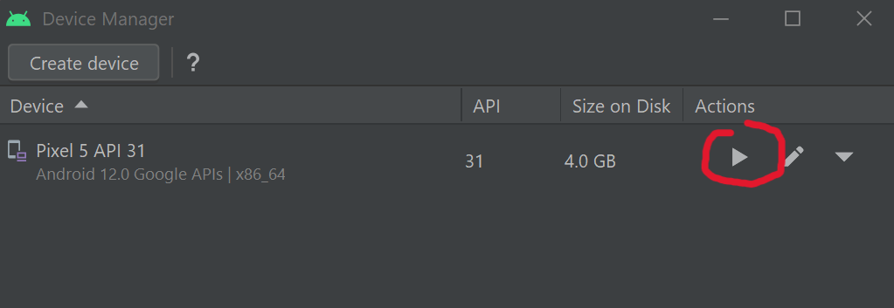
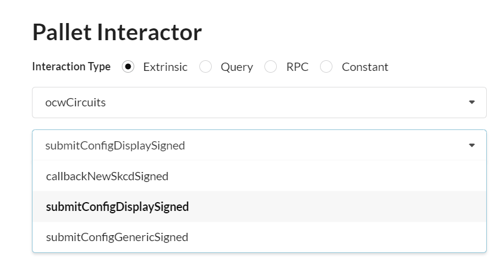
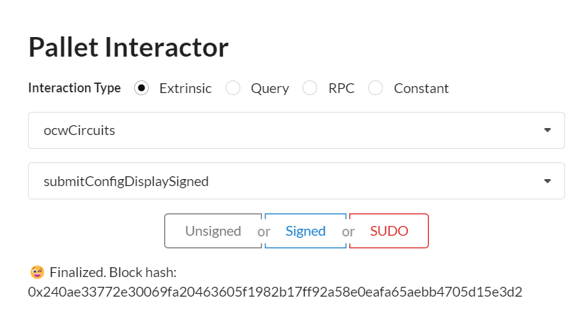
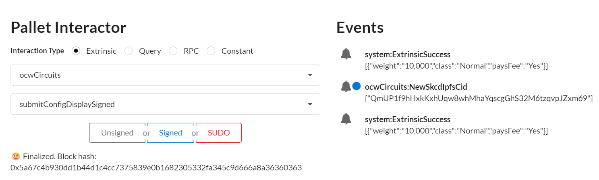
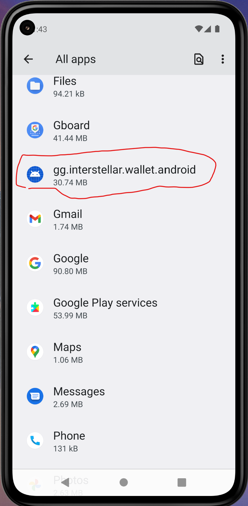
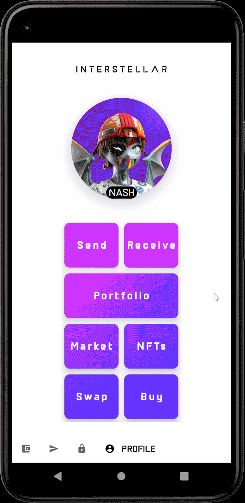

# M3 Demo Tutorial


## prerequiste: docker or podman

install
- docker: https://docs.docker.com/engine/install/

 or 

- podman: 
https://podman.io/getting-started/installation.html

then

- docker-compose: https://docs.docker.com/compose/install/

or

- podman-compose: https://github.com/containers/podman-compose#podman-compose


## Set-up Demo

### 1. Launch the blockchain
Create a directory

example:
```
mkdir blockchain_demo
```
 and add the following docker compose configuration file: [docker-compose.yml](https://github.com/Interstellar-Network/Interstellar-Book/blob/docker-compose/docker-compose.yml) in it.

Then start docker or podman
```
sudo service docker start
```
and then 
```
cd blockchain_demo
```
and launch the blockchain demo with `ipfs` and all api services i.e. `api_circuits` and `api_garble` with the following comand in the created directory.

```
docker-compose down --timeout 1 && docker-compose up --force-recreate
```
> replace `docker-compose` with `podman-compose` if you are using podman instead of docker


### 2. Launch a generic Substrate Fromt-end

Use the following [substrate link](https://substrate-developer-hub.github.io/substrate-front-end-template/?rpc=ws%3A%2F%2Flocalhost%3A9944) to launch substrate front end

to connect to a locally running node

> avoid some browser extensions that could generate interface issues


### 3. Install the wallet App i.e APK file on an android device or emulator


#### 3.1 Retrieve APK file

[APK](https://github.com/Interstellar-Network/wallet-app/actions/runs/2755412279

#### 3.2 Install the APK


#### 3.3 on an android device

#### 3.4 on an windows emulator

#### 3.4.1
[Install Android studio on windows](https://developer.android.com/studio/)

Install the pixel 5 API 31 emulator with Virtual Device Manager


#### 3.4.2 Launch the emulator



Wait for the emulator to launch and device to start and drag and drop the APK file on the emulator
to install the App

### 4. Ensure that wallet can connect to the blockchain

```
adb reverse tcp:5001 tcp:5001
```
```
adb reverse tcp:9944 tcp:9944 
```
to expose server desktop on emulator


## Demo purpose 

The purpose of this demo is to show how a mobile wallet can use the [Trusted Transaction Protocol client](./TTVP_Client.md) to confirm a transaction in a higly secure way


## Start The demo


> IMPORTANT: when interacting with pallets you MUST use the Signed button in blue to sign all the transactions, not SUDO, neither Unsigned

> this is excatly the step one of the M2 delivery demo tutorial
that ensure that the configuration display circuit is used by the Garble Circuit Factory

## 1. Generate with `ocwCircuits` the configuration display circuit 

### 1.1  Select ocwCircuits pallet and submitConfigDisplaySigned extrinsic



### 1.2 Sign transaction



### 1.3 Copy the ipfs hash/cid of the generated skcd file 

> the cid appears in Events (blue dot on this screenshot example)



## 2. Launch Android App
Go to setting, select All app then select `gg.interstellar.wallet.android`



click and then click open to launch it

## 2. Send a Currency

following is an explicit video showing how to send a curency to a contact


