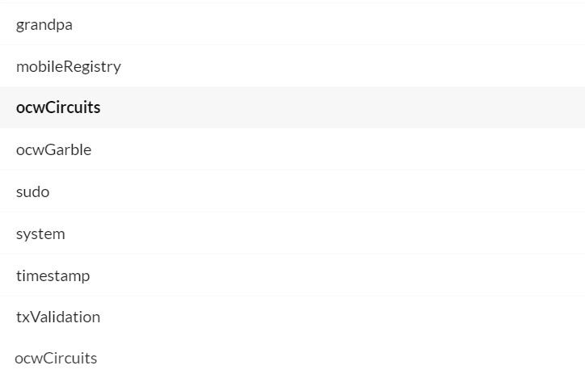
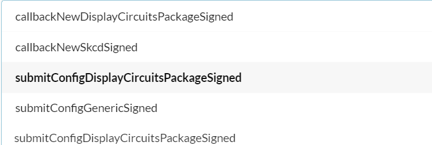
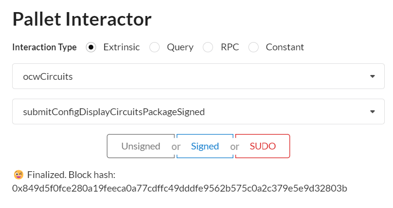
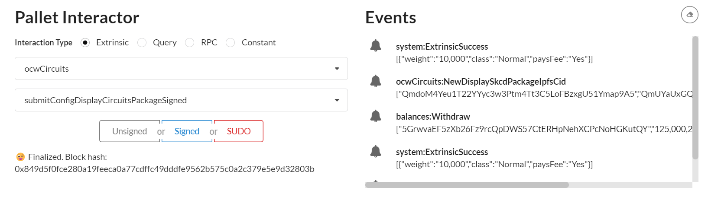
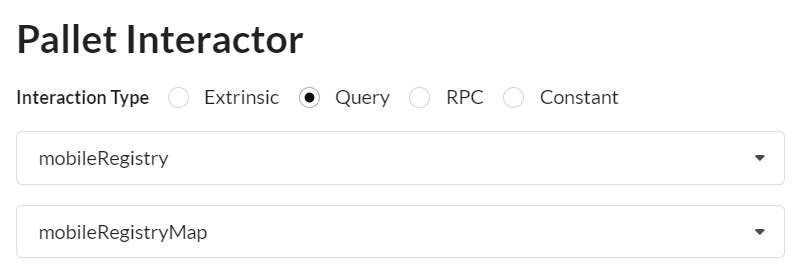

# M3 Demo Tutorial


## prerequiste: docker or podman

install
- docker: https://docs.docker.com/engine/install/

 or 

- podman: 
https://podman.io/getting-started/installation.html

then

- docker-compose: https://docs.docker.com/compose/install/

or

- podman-compose: https://github.com/containers/podman-compose#podman-compose


## Set-up Demo

### 1. Launch the blockchain
Create a directory

example:
```
mkdir blockchain_demo
```
 and add the following docker compose configuration file: [docker-compose.yml](https://github.com/Interstellar-Network/Interstellar-Book/blob/docker-compose/docker-compose.yml) in it.

Then start docker or podman
```
sudo service docker start
```
and then 
```
cd blockchain_demo
```
and launch the blockchain demo with `ipfs` and all api services i.e. `api_circuits` and `api_garble` with the following comand in the created directory.

```
docker-compose down --timeout 1 && docker-compose up --force-recreate
```
> replace `docker-compose` with `podman-compose` if you are using podman instead of docker


### 2. Launch a generic Substrate Fromt-end

Use the following [substrate link](https://substrate-developer-hub.github.io/substrate-front-end-template/?rpc=ws%3A%2F%2Flocalhost%3A9944) to launch substrate front end

to connect to a locally running node

> avoid some browser extensions that could generate interface issues


### 3. Install the wallet App i.e APK file on an android device or an emulator


#### 3.1 Retrieve the APK file
Download the [APK file](https://github.com/Interstellar-Network/wallet-app/releases/tag/milestone3)


#### 3.2 Install the APK
##### 3.2.1 on an android device

[How to install an APK on Android](https://www.lifewire.com/install-apk-on-android-4177185)

 WARNING: ensure that your device is configure for english.


##### 3.2.2 on an windows emulator

[Install Android studio](https://developer.android.com/studio/)

Install the pixel 5 API 31 emulator with Virtual Device Manager


#### 3.4.2 Launch the emulator


Wait for the emulator to launch and emulated device to power on and drag and drop the APK file on the emulator to install the App.

### 4. Ensure that wallet can connect to the blockchain

adb is installed by default with android studio.
So you just need to set-up its path on the OS used, if it is not already set.

Just connect the phone with an USB port or through WiFi( cf android studio).

on the OS where the emulator is installed or the device is connected:
```
adb reverse tcp:5001 tcp:5001
```
```
adb reverse tcp:9944 tcp:9944 
```
to expose server desktop on emulator

on the OS where blocchain is installed:

example if  blockchain run on WSL2
```
 export WSL_HOST_IP="$(tail -1 /etc/resolv.conf | cut -d' ' -f2)"
 ```
and use SSH to connect to the device or emulator on windows:
```
ssh -N -R 9944:localhost:9944 -R 5001:localhost:5001 [windows_user_name]@$WSL_HOST_IP
```
TROUBLESHOOTING: start the front-end
[substrate link](https://substrate-developer-hub.github.io/substrate-front-end-template/?rpc=ws%3A%2F%2Flocalhost%3A9944)
 on your Device/Emulator to check it works properly


## Demo purpose 

The purpose of this demo is to show how a mobile wallet can use the [Trusted Transaction Protocol client](./TTVP_Client.md) to confirm a transaction in a higly secure and hardware-backed trusted way on a smartphone device.

We focus on demonstrating:
1. The registration of the mobile device on the blockchain mobile registry.
2. The confirmation of a transaction through the TTVP protocol and the execution of the core low-level TTVP client on a smartphone device.

> The purpose of the demo is not yet to show a fully functional wallet. We want to demonstrate that the TTVP protocol and Trusted Authentication and UI Layer is working as expected with our substrate based blockchain pallets to authenticate and confirm transactions or sensible operations.

## Start The demo


## 1. Generate with `ocwCircuits` the configuration display circuit package

> IMPORTANT: when interacting with pallets you MUST use the Signed button in blue to sign all the transactions, not SUDO, neither Unsigned

> this is almost the same step one of the M2 delivery demo tutorial except that it generate of package of circuirts.

It set-up the configuration display circuit package used by the Garble Circuit Factory to generate randomized keyboard and message with one time code for each transactions.


### 1.1  Select ocwCircuits pallet 



### 1.2 select submitConfigDisplayPackageSigned extrinsic


### 1.3 Sign transaction



### 1.3 The cid of the circuit package generated appears in Events




## 2. Launch Android App
Swipe from bottom to top and click on `Wallet Interstellar`


## 3. Send a Currency and wait for the Transaction confirmation screen to validate the transaction

### 3.1 Select currency and contact
Following is an explicit video showing how to send a curency to a contact
on SEND screen.


### 3.2 Click on the blue Check icon

### 3.3 Wait for the transaction validation screen to appear and type the two-digits one-time-code

NOTE:
> The wallet app is still work in progress and we have still some little issues to fix between the low level layer in rust and C++, especially on the renderer to connect with the Kotlin/Swift UI layer.

 We want to avoid writting code that won't be used in the final version. For this reason we have made some little shortcut to demonstrate the execution of validation screen based on Garbled Circuits package eveluation.

> As a result we do not show yet the inputted amount and the transaction beneficiary in the message. Although the transaction validation screen is fully functional.

> Remark: Regarding the beneficiary of the transaction, we will implement a trusted beneficiary feature: a user will be able to create a trusted beneficiary contact whose public address will be registered in the blockchain through a sensitive operation message.

This makes public key address substitution impossible for an attacker. Bad actors won't be able to replace a contact name by their own public key.
Moreover, it makes the usage of the wallet much more user friendly and safer.

## 4. Check that mobile public key is registered on the mobile registry pallet

### 4.1 Copy the NewMobileRegistered `entry key` in MobileRegistry Events

When the mobile is registered an event with the entry in the MobileRegistryMap is generated


> underline in red


### 4.2 select mobileRegistry pallet

and mobileRegistryMap Query (not extrinsic)



Then  paste the entry key copied in the previous step


When the Query is completed you will see the mobile public key associated with the device as a result.

## 5. Check Mobile user's ínput and transaction status on the front-end


