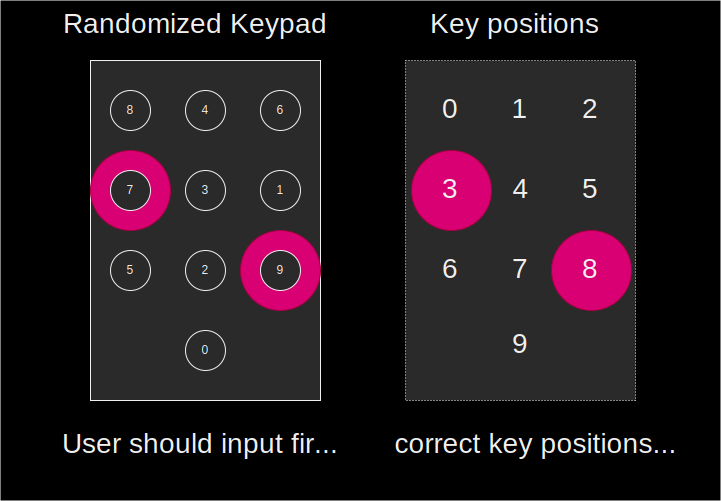
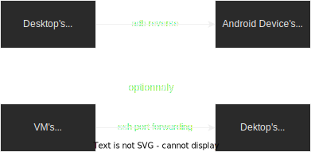
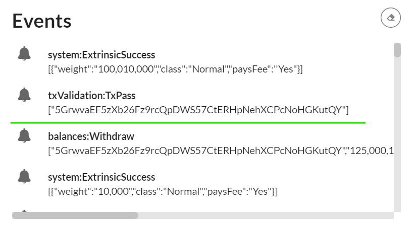
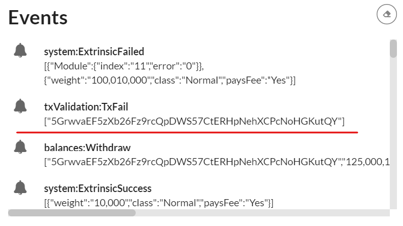

# M5 Demo Tutorial

The purpose of this demo is to test the integration of the garbled circuit production in TEE nodes to demonstrate our core security finalized proof of concept.

As explained previously the garbling scheme implemeted on TEE nodes and android client is not yet optimized for display circuits like the previous one.

So we also provide a script client to test the garble circuit production on TEE nodes.

You can also test that the end to end solution with an android client. 

> Although due to the current poor circuit evaluation performance, the validation screen is really difficult to read and does not reflect in any way the intended user experience

## prerequiste


| Install Docker | Install Podman |
| ------------   | -------------  |
|[docker](https://docs.docker.com/engine/install/)| [podman](https://podman.io/getting-started/installation.html) |
|[docker-compose](https://docs.docker.com/compose/install/)|[podman-compose](https://github.com/containers/podman-compose#podman-compose)|

NOTE: usually when using `docker` or `docker-comppse` you MUST also use `sudo`; and conversely you MUST NOT be root with `podman` and `podman-compose`

- `sudo apt-get install jq`

## Demo with script

### 1. Launch the blockchain

- prepare a temp folder eg: `mkdir interstellar_demo && cd interstellar_demo`
- get the following docker compose file: [docker-compose.yml](https://github.com/Interstellar-Network/Interstellar-Book/blob/docker-compose/docker-compose.yml#L17)
eg: `curl -o docker-compose.yml https://raw.githubusercontent.com/Interstellar-Network/Interstellar-Book/docker-compose/docker-compose.yml`
- *needed only if using docker:* 

    - download the following `docker-ipfs-init.sh` eg: 
    `curl -o docker-ipfs-init.sh https://raw.githubusercontent.com/Interstellar-Network/Interstellar-Book/docker-compose/docker-ipfs-init.sh`
    - check that the file is in the directory
    ```
    ls -al
    total 20
    drwxr-xr-x  2 jll jll 4096 Feb  9 16:46 .
    drwxr-xr-x 13 jll jll 4096 Feb  8 19:11 ..
    -rw-r--r--  1 jll jll 6383 Feb  9 16:52 docker-compose.yml
    -rw-r--r--  1 jll jll  222 Feb  9 15:06 docker-ipfs-init.sh
    ```
    - launch docker service:`sudo service docker start` 

  >podman does **not** require a service/daemon
- launch the full stack with the following command in the created directory: \
`sudo docker compose down --timeout 1 && sudo docker compose up --force-recreate` \
    >replace `docker compose` with `podman-compose` if you want to use podman instead of docker
- wait a few seconds until you see this kind of lines repeating:
```
2022-10-05 14:17:12 [ocw-circuits] Hello from pallet-ocw-circuits.
2022-10-05 14:17:12 [ocw-circuits] nothing to do, returning...
2022-10-05 14:17:12 💤 Idle (0 peers), best: #6 (0x369f…bfea), finalized #3 (0xa66a…6fa2), ⬇ 0 ⬆ 0
[+] Received finalized header update (4), syncing parent chain...
[+] Found 1 block(s) to sync
Synced 4 out of 4 finalized parentchain blocks
[+] Found 0 block(s) to sync
```


### [optional] 1.5 Launch a generic Substrate Front-end

Use the following [substrate link](https://substrate-developer-hub.github.io/substrate-front-end-template/?rpc=ws://localhost:9990) or [polkadot](https://polkadot.js.org/apps/?rpc=ws%3A%2F%2Flocalhost%3A9990#/chainstate) to launch a substrate front end
that will connect to the node running in `docker-compose`

> when using WSL: you **MUST** use `localhost` **NOT** `127.0.0.1` else the forwarding windows -> wsl -> docker/podman will not work [if you directly clicked on the given links it is already set, but be careful if you use another front-end]

> avoid some browser extensions that could generate interface issues


### 2. Run the integritee demo script


- get the demo script:
    * for consistency, make sure you are in the directory created at "prepare a temp folder" above
    * `curl https://raw.githubusercontent.com/Interstellar-Network/integritee-worker/interstellar/cli/demo_interstellar.sh -o demo_interstellar.sh`
    * `chmod +x demo_interstellar.sh`


- run the script [twice]:

    - `sudo docker compose run --entrypoint /usr/local/worker-cli/demo_interstellar.sh integritee_cli -P 2090 -p 9990 -u ws://integritee_node -V wss://integritee_service -R http://integritee_node:8990`


    >replace `sudo docker compose` by `podman-comnpose` in the previous command when using podman
    * the first time you start the demo it should say:
    ```
    [...]
    OCW_CIRCUITS_STORAGE: null
    OCW_CIRCUITS_STORAGE is NOT initialized
    MUST call extrinsic 'ocwCircuits::submitConfigDisplayCircuitsPackageSigned'
    Calling 'ocwCircuits::submitConfigDisplayCircuitsPackageSigned'
    Extrinsic started: wait a few seconds(~5-10s) and restart this script
    ```
    * wait a few seconds
    * check docker-compose/podman-compose logs; you should see something like
    ```
    2022-10-05T14:35:08.974284Z DEBUG hyper::proto::h1::conn: incoming body is chunked encoding
    2022-10-05T14:35:08.974294Z DEBUG hyper::proto::h1::decode: incoming chunked header: 0x82 (130 bytes)
    2022-10-05T14:35:09.019290Z DEBUG hyper::proto::h1::conn: incoming body completed
    2022-10-05T14:35:09.019378Z DEBUG hyper::proto::h1::role: response with HTTP2 version coerced to HTTP/1.1
    2022-10-05T14:35:09.019433Z DEBUG hyper::proto::h1::io: flushed 220 bytes
    2022-10-05 14:35:09 [fetch_from_remote_grpc_web] status code: 200, content_type: application/grpc-web+proto
    2022-10-05 14:35:09 [fetch_from_remote_grpc_web] header: content-type application/grpc-web+proto
    2022-10-05 14:35:09 [fetch_from_remote_grpc_web] header: transfer-encoding chunked
    2022-10-05 14:35:09 [fetch_from_remote_grpc_web] header: date Wed, 05 Oct 2022 14:35:08 GMT
    2022-10-05 14:35:09 [ocw-circuits] callback_new_skcd_signed sent number : 1
    ```
    it MUST say "callback_new_skcd_signed sent number : **1**" NOT **0**
- re-run the script
- when asked for inputs `Inputs to use? [space separated list of int; eg 0 1 2 3]`
    * enter a space-separated list of digits eg `4 2`
    * if you used invalid inputs, you will see eg `Trusted call 0x7275e5e0fe5812ee9560a6b23469fe3007af3a080b11f88ad71c66364393f6d8 is Invalid`
    * if the used the correct code, you will see eg `Trusted call 0xbd86033441f672f15d6cfedd3180d1da21c86aa46469e0d4eadb6daa673b87bc is InSidechainBlock(0xb8795299ef99d5501f6d9767b9fee012c6342be2435440a598bebd6b49260951)`

#### NOTE: How to get the correct code

When the script is waiting for inputs, check the docker-compose logs for something like:
```
[2022-10-05T14:41:43Z INFO  pallet_tx_validation::pallet] [tx-validation] store_metadata_aux: who = , message_pgarbled_cid = "QmbcKoDVkFQDQRDJgwd7HWMgbJ5GnurEZgDEUivn9Fsf5Y", message_digits = [9, 7], pinpad_digits = [8, 4, 6, 7, 3, 1, 5, 2, 9, 0]
```

* In this example the correct code is `[9, 7]` and the permutation of the pinpad are `[8, 4, 6, 7, 3, 1, 5, 2, 9, 0]`
    * NOTE: if you go back to the previous milestone demo, that is the order of the digit displayed on the Android app





* `9` is the <u>eighth</u> digit in the list(0-indexed) and `7` the <u>third</u> one
* you must enter `8 3` when prompted


## Demo with Android client


### 1. Launch the blockchain
if not yet launched (same process as with demo script)

### 2. Launch a generic Substrate Fromt-end

Use the following [substrate link](https://substrate-developer-hub.github.io/substrate-front-end-template/?rpc=ws%3A%2F%2Flocalhost%3A9944) to launch substrate front end

to connect to a locally running node

> avoid some browser extensions that could generate interface issues


### 3. Install the wallet App i.e APK file on an android device or an emulator


#### 3.1 Retrieve the APK file
Download the [APK file](https://github.com/Interstellar-Network/wallet-app/releases/tag/milestone5)


#### 3.2 Install the APK
##### 3.2.1 on an android device

[How to install an APK on Android](https://www.lifewire.com/install-apk-on-android-4177185)

 WARNING: ensure that your device is configure for english.


##### 3.2.2 on an windows emulator

[Install Android studio](https://developer.android.com/studio/)

Install the pixel 5 API 31 emulator with Virtual Device Manager or any `x86_64` emulator.


#### 3.4.2 Launch the emulator


Wait for the emulator to launch and emulated device to power on and drag and drop the APK file on the emulator to install the App.

### 4. Ensure that wallet can connect to the blockchain

>The app is currently a dev version, so it expects the servers(RPC/WS, and IPFS) to be on localhost.

Which is obviously not the case when running on Device/Emulator.

To remedy `adb reverse` will expose "`localhost` of the desktop" as "`localhost` of the device".

>Then, IF the blockchain(docker-compose) are NOT running on the desktop, you need to expose them. It can be done e.g. using ssh port forwarding, or through some other means.



Following is a configuration example with a windows desktop that run an android emulator and a WSL/VM running the blockchain(docker-compose)

adb is installed by default with android studio.
So you just need to set-up its path on the OS used, if it is not already set.

Just connect the phone with an USB port or through WiFi( cf android studio).

on the OS where the emulator is running or the device is connected:
```
adb reverse tcp:9990 tcp:9990
```
```
adb reverse tcp:2090 tcp:2090 
```
```
adb reverse tcp:5001 tcp:5001
```

to expose server desktop on emulator

on the OS where blocchain is installed:

example if  blockchain run on WSL2
```
 export WSL_HOST_IP="$(tail -1 /etc/resolv.conf | cut -d' ' -f2)"
 ```
and use SSH to connect to the emulator running on windows or android devices connected to adb through USB port or WiFi:
```
ssh -N -R 9944:localhost:9944 -R 5001:localhost:5001 [windows_user_name]@$WSL_HOST_IP
```
TROUBLESHOOTING: start the front-end
[substrate link](https://substrate-developer-hub.github.io/substrate-front-end-template/?rpc=ws%3A%2F%2Flocalhost%3A9944)
 on your Device/Emulator to check it works properly.
 Otherwise fix network issues.


## Demo purpose 

The purpose of this demo is to show how a mobile wallet can use the [Trusted Transaction Protocol client](./TTVP_Client.md) to confirm a transaction in a higly secure and hardware-backed trusted way on a smartphone device.

We focus on demonstrating:
1. The registration of the mobile device on the blockchain mobile registry.
2. The confirmation of a transaction through the TTVP protocol and the execution of the core low-level TTVP client on a smartphone device.

> The purpose of the demo is not yet to show a fully functional wallet. We want to demonstrate that the TTVP protocol and Trusted Authentication and UI Layer is working as expected with our substrate based blockchain pallets to authenticate and confirm transactions or sensible operations.

## Start The demo


## 1. Generate with `ocwCircuits` the configuration display circuit package

> IMPORTANT: when interacting with pallets you MUST use the Signed button in blue to sign all the transactions, not SUDO, neither Unsigned

> this is almost the same step one of the M2 delivery demo tutorial except that it generate of package of circuirts.

It set-up the configuration display circuit package used by the Garble Circuit Factory to generate randomized keyboard and message with one time code for each transactions.


### 1.1  Select ocwCircuits pallet 


### 1.2 select submitConfigDisplayPackageSigned extrinsic


### 1.3 Sign transaction


### 1.3 The cid of the circuit package generated appears in Events


## 2. Launch Android App
Swipe from bottom to top and click on `Wallet Interstellar`


## 3. Send a Currency and wait for the Transaction confirmation screen to validate the transaction

### 3.1 Select currency and contact
Following is an explicit video showing how to send a curency to a contact
on SEND screen.


### 3.2 Click on the blue Check icon

### 3.3 Wait for the transaction validation screen to appear and type the two-digits one-time-code

### 3.4 check Toast message order
- Processing...
- Registered
- [error] No circuits available after 10s; exiting!

[after taping one-time code digits]
- Validating transaction...
- Transaction done!


NOTE:
> The wallet app is still work in progress and we have still some little issues to fix between the low level layer in rust and C++, especially on the renderer to connect with the Kotlin/Swift UI layer.

 We want to avoid writting code that won't be used in the final version. For this reason we have made some little shortcut to demonstrate the execution of validation screen based on Garbled Circuits package eveluation.

> As a result we do not show yet the inputted amount and the transaction beneficiary in the message. Although the transaction validation screen is fully functional.

> Remark: Regarding the beneficiary of the transaction, we will implement a trusted beneficiary feature: a user will be able to create a trusted beneficiary contact whose public address will be registered in the blockchain through a sensitive operation message validation.

This makes the classic public key address substitution impossible for an attacker. Bad actors won't be able to replace a contact name by their own public key.
Moreover, it makes the usage of the wallet much more user friendly and safer.

## 4. Check that mobile public key is registered on the mobile registry pallet

### 4.1 Copy the `account key` in MobileRegistry Events

When the mobile is registered with an account, its mobile public key is stored on mobileRegistryMap in `MobileRegistry` pallet and an event is generated


> underline in red


### 4.2 select mobileRegistry pallet

and mobileRegistryMap Query (not extrinsic)


Then  paste the copied `account key`


When the Query is completed you will see the mobile public key associated with the device as a result.

> this public key is used to verify the hardware-backed signature of the transaction confirmation message that includes position typed by the user on the randomized keypad

## 5. Check Mobile user's ínput and transaction status on the front-end

Check the events

### 5.1 Transaction Success


you will see in the events

if the one-time-code was entered properly

### 5.2 Transaction Fail

you will see in the events

if the one-time-code was wrong


