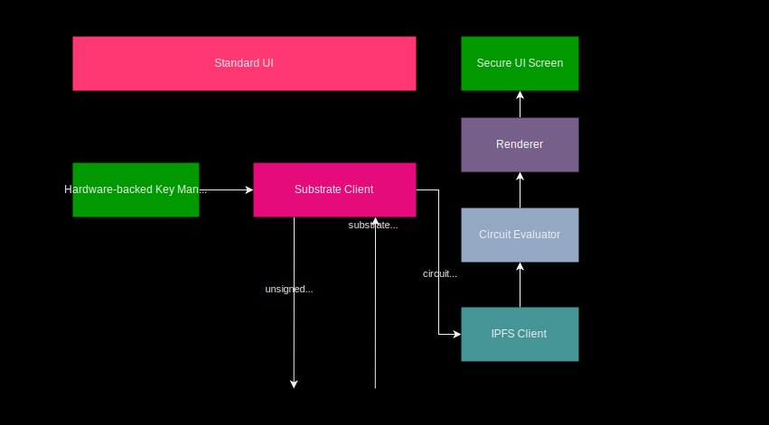

# Mobile Wallet Demo App

The mobile wallet demo app include mainly a [Trusted Transaction Validation Protocol client](./TTVP_client.md) that is securely linked with the blockchain through [mobile registry](./Mobile_Registry.md)

This client is based on a substrate client on the mobile to connect to the blockchain substrate regsitry module/pallet through unsigned extrinsic with signed option and substarte events.

It also include an IPFS client to retrieve the cid of the [Visual Cryptography Display](./VC-GC.md) i.e the one-time [Garbled Circuit](,/GC.md) program generated for each transaction  by the [Garbled Circuit Factory](./GCF.md).

The previous circuit is used by the[Trusted Authentication User Interface](./TAUI.md) that evaluates the previous circuit and render it to enable the user to confirm a transaction.

In order to do that this secure UI layer relies on a circuit evaluator and a renderer to display the result of its evaluation on the framebuffer.

