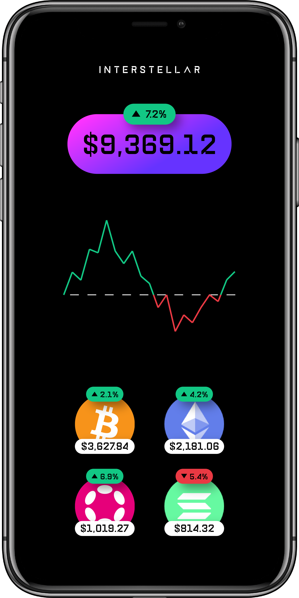
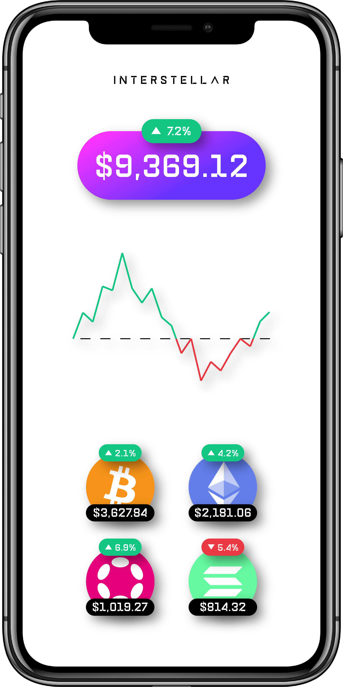
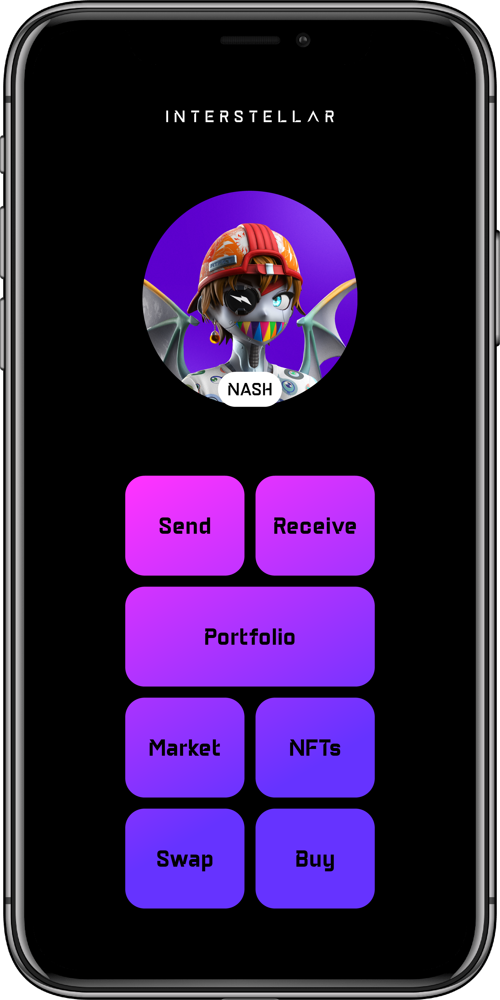
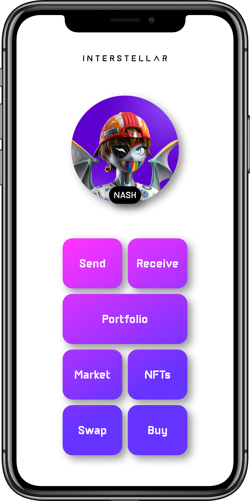
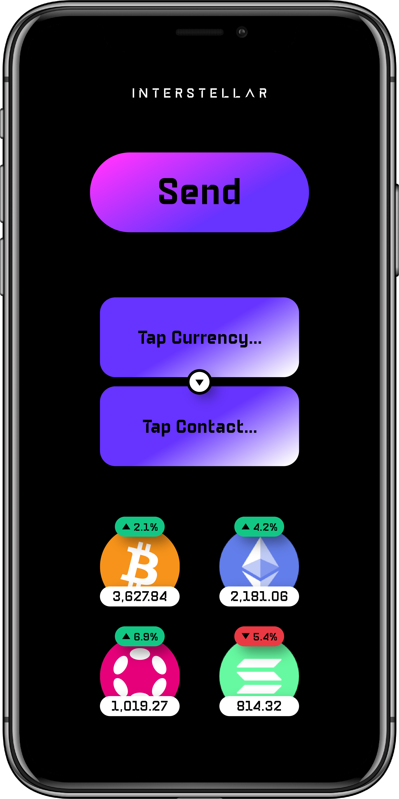
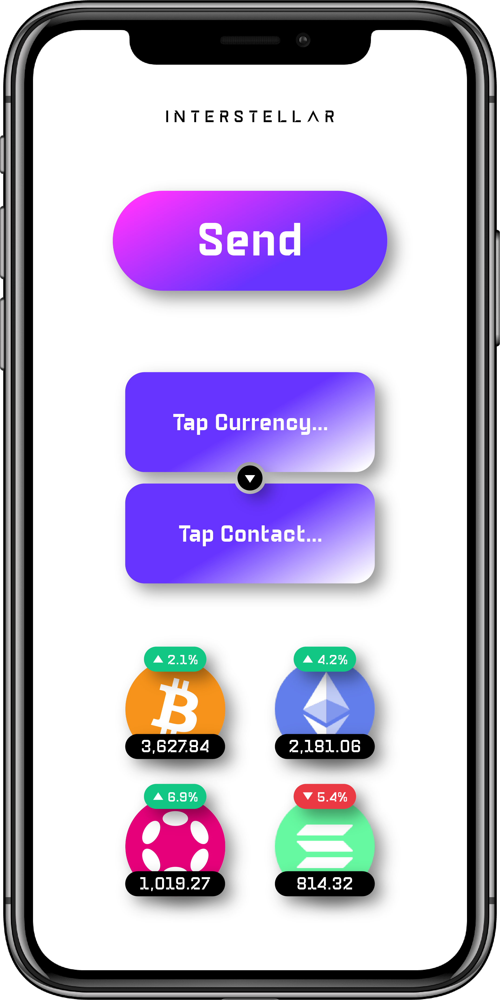
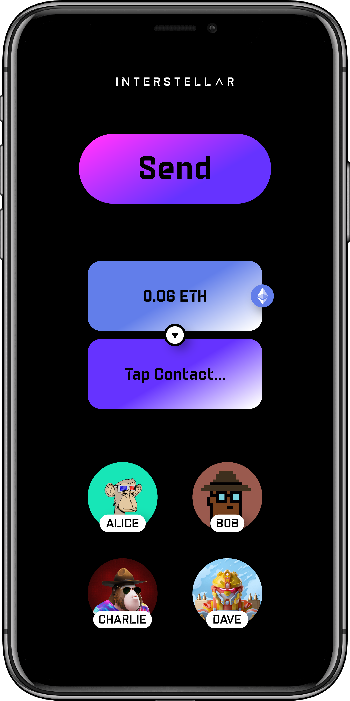
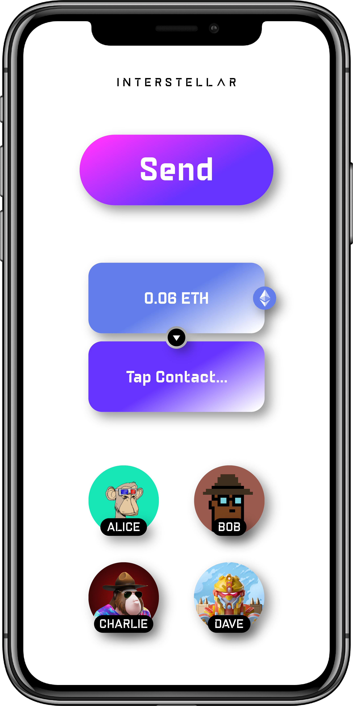
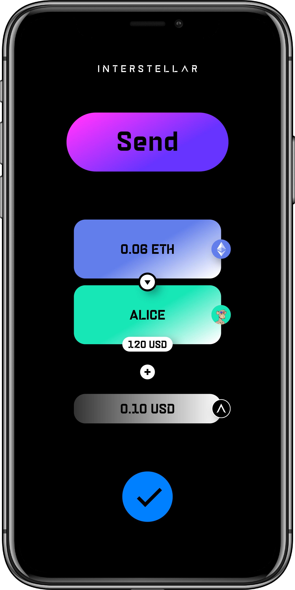
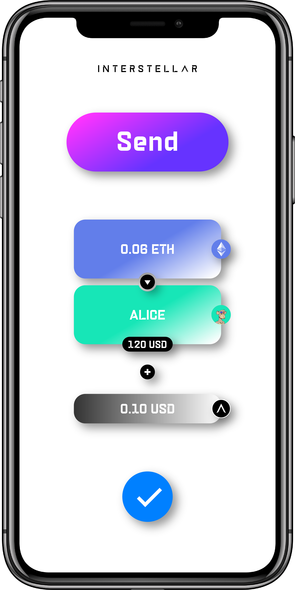

# Mobile Wallet Demo App

The mobile wallet demo app include mainly a [Trusted Transaction Validation Protocol client](./TTVP_client.md) that is securely linked with the blockchain through [mobile registry](./Mobile_Registry.md)

It also includes a wallet UI to perform transactions

## Send a Currency

following are wallet screenshots of the main screens.

## Portfolio Screens

..

## Profile Screens

..

## Send Screens

### Tap Currency

..

### Tap Contact

..

### Send

..

