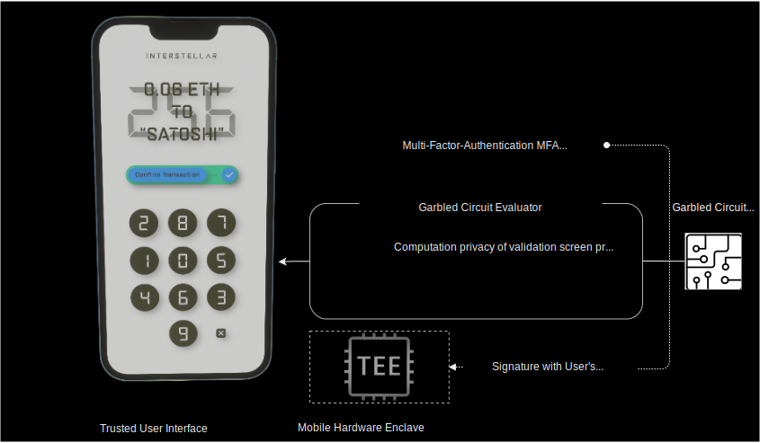

# Trusted Authentification and UI Layer

Following a schema illustrating how the trusted authentication and transaction validation is managed.  

## 1 The mobile received a transaction to validate

For each transaction to validate, a one time program i.e garbled circuit is received and executed by the garbled circuit evaluator on the mobile.

## 2 User input
Then the user input on the randomized keyboard the one time code he see on the screen.

## 3 Signature of user input 
Fingerprint and/or facial recognization trigger the signature
of the user input with mobile private key stored in TEE before it is sent to the nodes.