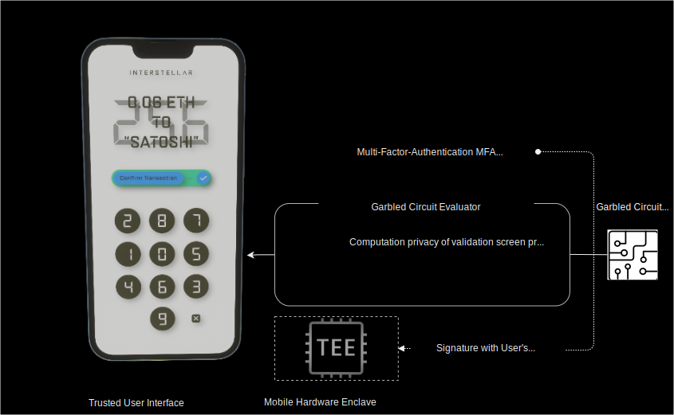

# Trusted Authentification and UI Layer

Following a schema illustrating how the trusted authentication and transaction validation is managed.  

## 1 The mobile received a transaction to validate

For each transaction to validate, a one time program i.e. [garbled circuit](./GC.md) is received and executed by the garbled circuit evaluator on the mobile to display the [Validation Screen](./VC-GC.md)

## 2 User input
Then the user inputs on the randomized keypad the one time code he see on the screen: 256 in this example.
P1(x1,y1), P2(x2,y2), P3(x3,y3) are the inputs positions matching 2,5,6 on the one time random keypad.

## 3 Signature of user input 
Fingerprint and/or facial recognization trigger the signature
of the user inputs with mobile private key stored in TEE.
Then the signed random position i.e. P1, P2, P3 are sent to the nodes to be verified.