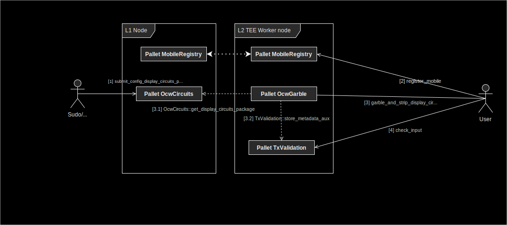

# Trusted Transaction Validation Protcol implementation in TEE

A part of the transaction validation protocol is implemented whithin a Trusted Execution Environement in hardware enclave nodes i.e Integritee workers.

Following a scheme with flowchart explaining what part is within Layer 2 i.e L2 TEE worker nodes and what part is managed whithin Layer 1 i.e L1 nodes

