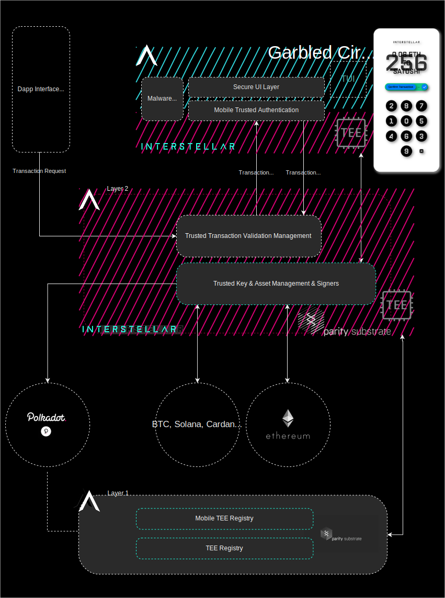

# Trusted Transaction Validation Protocol

## Trusted Transaction Validation Protocol architecture overview

This following schema shows the main components of Interstellar blockchain including the modules related to Trusted Transaction Validation protocol.It also includes future roadmap modules (briefly described)

## High level components of Interstellar blockchain

Those modules are based on Parity Substrate nodes and IntegriTEE workers.

### Transaction Screen Management
The transaction screen is managed with Garbled Circuits that are computed on TEE nodes and provisioned on the mobile by the nodes. The one-time code secret and keypad topology cannot be accessed during Garbled Circuit execution to display the Visual Cryptography secret frames that appears only in the users' eyes.  Thanks to persistence of vision.

### Mobile Key Management
A Public/Private key pair is generated in the mobile Hardware Enclave. The private key is not accessible by anyone, even when the device is rooted. The signature is only triggered with the user's biometrics (also managed with TEE).
This mobile Private key and Garbled Circuits are securely tied with the wallet private keys associated with the user's assets and managed in the blockchain hardware enclave TEE nodes. In order to prevent potential attacks on hardware enclaves, we will also use at later stage Multi Party Computation and especially Threshold Signature Scheme.

 
#### Mobile TEE registry pallet
This is the module for the management of private keys on the devices that will be used for unsigned transaction extrinsic with signed option i.e. verification of message signatures with mobile public keys. This pallet will also register all information related to TEE, security and identification of mobile devices when available. It includes the following  key and ID Attestation and other hardware protected  features like  [Protected confirmation](https://source.android.com/security/protected-confirmation) mobile app signing, etc...

### Attestation management (roadmap)

[Key and ID Attestation  |  Android Open source project](https://source.android.com/security/keystore/attestation)

[How to check whether Android phone supports TEE- Stack Overflow](https://stackoverflow.com/questions/61225795/how-to-check-whether-android-phone-supports-tee/64422042#64422042)
 

### Behavioral Biometric (roadmap)
Each user has a unique typing pattern for a sequence of digits on a keypad. If a bad actor tries to replicate this pattern, it will be detected with a 98% success rate. This feature will be managed by TEE nodes with Machine Learnings classification models based on secret touch screen position inputs received by the nodes and their related authenticated timestamps.

[TOUCH DYNAMICS BIOMETRICS TO ENHANCE AUTHENTICATION ON MOBILE DEVICES](https://www.research.manchester.ac.uk/portal/files/159168194/FULL_TEXT.PDF)

### Ongoing Research (roadmap)
Garbled circuits to generate proof of history of legitimate computation schemes to detect malware attacks to compromise the UI i.e. the building and execution of a fake User Interface by the attackers.