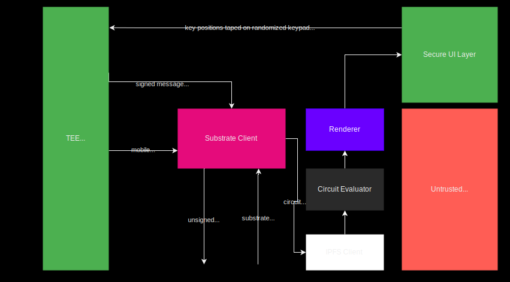

# Trusted Transaction Validation Protocol client

This is the client software embedded in an app or browser in the future that  enables the secure confirmation of any transactions or sensitive operation with an hardware level security.
(cf [Tusted Transaction Validation Protocol](./TTVP.md))

It implements the [Trusted Authentication and User Interface Layer](./TAUI.md) combined with [Harware-backed Mobile Key](./HBMK.md) and is regsitered in the [Mobile TEE Registry](./Mobile_Registry.md)

## Architecture and Security


> Green boxes are secure as well as garbled circuit evaluation in Dark Grey
it prevents state of the art Banking trojan attacks on the mobile

This client is based on a substrate client on the mobile to communicate through unsigned extrinsic with signed option and substrate events with the blockchain. It enables the mobile to be registered with the mobile TEE registry pallet. 


It also include an IPFS client to retrieve the cid of the [Visual Cryptography Display](./VC-GC.md) i.e the one-time [Garbled Circuit](,/GC.md) program generated for each transaction  by the [Garbled Circuit Factory](./GCF.md) managed by the blockchain.

The previous circuit is used to compose the [Trusted Authentication and User Interface Layer](./TAUI.md) i.e `Secure UI Screen` that evaluates and renders the circuit to enable the user to confirm a transaction/sensitive operation with a `one-time code`

This Secure UI layer relies on a garbled circuit evaluator and a renderer to display the result of its evaluation directly to the framebuffer.
## TTVP client components


Following are the main components of the mobile client
### Substrate Client

[wallet-app/shared/rust/substrate-client/src](https://github.com/Interstellar-Network/wallet-app/blob/master/shared/rust/substrate-client/src/lib.rs)

following are the main extrinsics used

#### `extrinsic_garble_and_strip_display_circuits_package_signed`
Get garbled Circuit package from ocwGarble pallet

```rust
fn extrinsic_garble_and_strip_display_circuits_package_signed(
    api: &Api<sp_core::sr25519::Pair, WsRpcClient>,
    tx_message: &str,
) -> Hash {
    ////////////////////////////////////////////////////////////////////////////
    // // "set the recipient"
    // let to = AccountKeyring::Bob.to_account_id();

    // // "the names are given as strings"
    // #[allow(clippy::redundant_clone)]
    // let xt: UncheckedExtrinsicV4<_> = compose_extrinsic!(
    //     api.clone(),
    //     "Balances",
    //     "transfer",
    //     GenericAddress::Id(to),
    //     Compact(42_u128)
    // );
    ////////////////////////////////////////////////////////////////////////////
    #[allow(clippy::redundant_clone)]
    let xt: UncheckedExtrinsicV4<_> = compose_extrinsic!(
        api.clone(),
        // MUST match the name in /substrate-offchain-worker-demo/runtime/src/lib.rs
        "OcwGarble",
        // MUST match the call in /substrate-offchain-worker-demo/pallets/ocw-circuits/src/lib.rs
        "garble_and_strip_display_circuits_package_signed",
        tx_message.as_bytes().to_vec()
    );

    println!("[+] Composed Extrinsic:\n {:?}\n", xt);

    // "send and watch extrinsic until InBlock"
    let tx_hash = api
        .send_extrinsic(xt.hex_encode(), XtStatus::InBlock)
        .unwrap();
    println!("[+] Transaction got included. Hash: {:?}", tx_hash);

    tx_hash.expect("send_extrinsic failed")
}
```

#### `extrinsic_register_mobile`
send the mobile public key to be registered in the Mobile Registry pallet
```rust
pub fn extrinsic_register_mobile(
    api: &Api<sp_core::sr25519::Pair, WsRpcClient>,
    pub_key: Vec<u8>,
) -> Hash {
    #[allow(clippy::redundant_clone)]
    let xt: UncheckedExtrinsicV4<_> = compose_extrinsic!(
        api.clone(),
        // MUST match the name in /substrate-offchain-worker-demo/runtime/src/lib.rs
        "MobileRegistry",
        // MUST match the call in /substrate-offchain-worker-demo/pallets/ocw-circuits/src/lib.rs
        "register_mobile",
        pub_key
    );

    println!("[+] Composed Extrinsic:\n {:?}\n", xt);

    // "send and watch extrinsic until InBlock"
    let tx_hash = api
        .send_extrinsic(xt.hex_encode(), XtStatus::InBlock)
        .unwrap();
    println!("[+] Transaction got included. Hash: {:?}", tx_hash);

    tx_hash.expect("send_extrinsic failed")
}
```
### `extrinsic_check_input`
check user input i.e one-time-code inputted on the randomized keypad
```rust
pub fn extrinsic_check_input(
    api: &Api<sp_core::sr25519::Pair, WsRpcClient>,
    ipfs_cid: Vec<u8>,
    input_digits: Vec<u8>,
) -> Hash {
    #[allow(clippy::redundant_clone)]
    let xt: UncheckedExtrinsicV4<_> = compose_extrinsic!(
        api.clone(),
        // MUST match the name in /substrate-offchain-worker-demo/runtime/src/lib.rs
        "TxValidation",
        // MUST match the call in /substrate-offchain-worker-demo/pallets/ocw-circuits/src/lib.rs
        "check_input",
        ipfs_cid,
        input_digits
    );

    println!("[+] Composed Extrinsic:\n {:?}\n", xt);

    // "send and watch extrinsic until InBlock"
    let tx_hash = api
        .send_extrinsic(xt.hex_encode(), XtStatus::InBlock)
        .unwrap();
    println!("[+] Transaction got included. Hash: {:?}", tx_hash);

    tx_hash.expect("send_extrinsic failed")
}
```

### Garble Circuit Evaluator
This is the high level part in rust that encapsulated call to lower level C++ evaluator
```rust
pub use cxx;

use aes::cipher::{
    generic_array::{typenum::consts::U16, GenericArray},
    BlockEncrypt, KeyInit,
};
use aes::Aes128;

#[cxx::bridge]
pub mod ffi {

    // Rust types and signatures exposed to C++.
    extern "Rust" {
        type MyRustAes;

        unsafe fn encrypt_block(aes: &MyRustAes, low: &mut u64, high: &mut u64);

        /// param: key: usually a PGC's global_key field
        // Box<> else "returning opaque Rust type by value is not supported"
        unsafe fn init_aes(key_low: u64, key_high: u64) -> Box<MyRustAes>;
    }

    unsafe extern "C++" {
        include!("circuit-evaluate/src/rust_wrapper.h");

        type EvaluateWrapper;

        /// Create a new EvaluateWrapper, to be used later eg
        /// let evaluate_wrapper = ffi::new_evaluate_wrapper(...);
        /// evaluate_wrapper.EvaluateWithInputs(...); etc
        ///
        /// param: pgarbled_buffer can be a FULL, or a STRIPPED circuit
        /// typically in PROD we use STRIPPED ones, but for tests/dev we keep compat with FULL circuits
        /// [in which case] packmsg_buffer can be empty
        fn new_evaluate_wrapper(
            pgarbled_buffer: Vec<u8>,
            packmsg_buffer: Vec<u8>,
        ) -> UniquePtr<EvaluateWrapper>;

        /// PROD version
        /// inputs are randomized, outputs are externally given
        /// typically outputs points to some kind of "Texture data"
        fn EvaluateWithPackmsg(self: Pin<&mut EvaluateWrapper>, outputs: &mut Vec<u8>);
        /// TEST/DEV only
        /// PROD uses randomize inputs
        fn EvaluateWithPackmsgWithInputs(&self, inputs: Vec<u8>) -> Vec<u8>;
        /// TEST/DEV only
        /// PROD is using the PACKMSG version
        fn EvaluateWithInputs(&self, inputs: Vec<u8>) -> Vec<u8>;

        fn GetNbInputs(&self) -> usize;
        fn GetNbOutputs(&self) -> usize;
        fn GetWidth(&self) -> usize;
        fn GetHeight(&self) -> usize;
    }
}

/// We MUST impl Send+Sync b/c EvaluateWrapper is used as a Bevy's Resource
/// EvaluateWithPackmsg/etc use a "const" PGC so on that part we are thread safe
/// BUT EvaluateWithPackmsg in circuit_evaluate/src/rust_wrapper.cpp MAY NOT be thread safe
/// depending on where "outputs" are(eg NOT thread safe if a class field, thread safe if returning std::vector)
unsafe impl Send for ffi::EvaluateWrapper {}
unsafe impl Sync for ffi::EvaluateWrapper {}

pub struct MyRustAes {
    pub aes: Aes128,
}

pub fn encrypt_block(aes: &MyRustAes, low: &mut u64, high: &mut u64) {
    // init "block" from "high+low"
    // TODO or better instead of "high, low" params: rewrite to accept a param like "key: *const c_char" and use reinterpret_cast(&this) in block.h?
    let input_vec: Vec<u8> = if cfg!(target_endian = "big") {
        let mut v: Vec<u8> = vec![];
        v.extend(low.to_be_bytes());
        v.extend(high.to_be_bytes());
        v
    } else {
        let mut v: Vec<u8> = vec![];
        v.extend(low.to_le_bytes());
        v.extend(high.to_le_bytes());
        v
    };

    let mut block: GenericArray<u8, U16> = GenericArray::clone_from_slice(input_vec.as_slice());

    aes.aes.encrypt_block(&mut block);

    let low_arr: [u8; 8] = block.as_slice()[..8].try_into().expect("Wrong length");
    let high_arr: [u8; 8] = block.as_slice()[8..].try_into().expect("Wrong length");

    if cfg!(target_endian = "big") {
        *low = u64::from_be_bytes(low_arr);
        *high = u64::from_be_bytes(high_arr);
    } else {
        *low = u64::from_le_bytes(low_arr);
        *high = u64::from_le_bytes(high_arr);
    }
}

fn init_aes(key_low: u64, key_high: u64) -> Box<MyRustAes> {
    let key: Vec<u8> = if cfg!(target_endian = "big") {
        let mut v: Vec<u8> = vec![];
        v.extend(key_low.to_be_bytes());
        v.extend(key_high.to_be_bytes());
        v
    } else {
        let mut v: Vec<u8> = vec![];
        v.extend(key_low.to_le_bytes());
        v.extend(key_high.to_le_bytes());
        v
    };

    Box::new(MyRustAes {
        aes: Aes128::new_from_slice(&key).unwrap(),
    })
}
```
low level C++ garbled circuits evaluator part

[wallet-app/shared/rust/circuit_evaluate/src/cpp/](https://github.com/Interstellar-Network/wallet-app/tree/master/shared/rust/circuit_evaluate/src/cpp)

### Renderer
This is the layer in charge of writting the results of display circuits evaluation directly to the framebuffer through GPU shaders
[wallet-app/shared/rust/renderer](https://github.com/Interstellar-Network/wallet-app/tree/master/shared/rust/renderer)

One of the most critical part of the renderer, responsible to create surface view in which renderer will display the texture resulting of circuits evaluation/execution
```rust
use android_logger::Config;
use bevy::prelude::Color;
use common::DisplayStrippedCircuitsPackageBuffers;
use core::ffi::c_void;
use jni::objects::{JClass, JObject, JString, ReleaseMode};
use jni::sys::{jbyteArray, jfloat, jfloatArray, jint, jlong, jstring};
use jni::JNIEnv;
use jni_fn::jni_fn;
use log::{debug, info, Level};
use raw_window_handle::{AndroidNdkHandle, RawWindowHandle};

// #[cfg(target_os = "android")]
use android_logger::FilterBuilder;

use crate::{
    init_app, my_raw_window_handle, update_texture_utils, vertices_utils::Rect, App,
    TextureUpdateCallbackType,
};

extern "C" {
    pub fn ANativeWindow_fromSurface(env: JNIEnv, surface: JObject) -> usize;
    // TODO maybe use:ANativeWindow_getFormat?
    pub fn ANativeWindow_getHeight(window_ptr: usize) -> u32;
    pub fn ANativeWindow_getWidth(window_ptr: usize) -> u32;
}

pub fn get_raw_window_handle(env: JNIEnv, surface: JObject) -> (RawWindowHandle, u32, u32) {
    let a_native_window = unsafe { ANativeWindow_fromSurface(env, surface) };
    let mut handle = AndroidNdkHandle::empty();
    handle.a_native_window = a_native_window as *mut c_void;

    let width = unsafe { ANativeWindow_getWidth(a_native_window) };
    let height = unsafe { ANativeWindow_getHeight(a_native_window) };

    return (RawWindowHandle::AndroidNdk(handle), width, height);
}

// TODO static state? or return Box<State> in initSurface and store as "long" in Kotlin?
// static mut state: Option<State> = None;size

fn init_surface(
    env: JNIEnv,
    surface: JObject,
    messageRects: jfloatArray,
    pinpadRects: jfloatArray,
    pinpad_nb_cols: usize,
    pinpad_nb_rows: usize,
    message_text_color: Color,
    circle_text_color: Color,
    circle_color: Color,
    background_color: Color,
    message_pgarbled_buf: Vec<u8>,
    message_packmsg_buf: Vec<u8>,
    pinpad_pgarbled_buf: Vec<u8>,
    pinpad_packmsg_buf: Vec<u8>,
) -> jlong {
    // TODO use loggers.rs(same as substrate-client)
    // WARNING: conflicts with substrate-client/src/loggers.rs
    // only the first one called is taken into account
    android_logger::init_once(
        Config::default()
            .with_min_level(Level::Info)
            .with_tag("interstellar")
            .with_filter(
                FilterBuilder::new()
                    // useful: wgpu_hal=info
                    .parse("info,jni::crate=debug")
                    .build(),
            ),
    );

    let (handle, width, height) = get_raw_window_handle(env, surface);
    log::debug!(
        "initSurface: got handle! width = {}, height = {}",
        width,
        height
    );
    info!("initSurface before new_native");

    let mut message_rects_vec = unsafe {
        convert_rect_floatArr_to_vec_rect(env, messageRects, width as f32, height as f32)
    };
    let mut pinpad_rects_vec =
        unsafe { convert_rect_floatArr_to_vec_rect(env, pinpadRects, width as f32, height as f32) };
    assert!(
        message_rects_vec.len() == 1,
        "should have only ONE message_rects!",
    );
    assert!(
        pinpad_rects_vec.len() == pinpad_nb_cols * pinpad_nb_rows,
        "pinpadRects length MUST = pinpad_nb_cols * pinpad_nb_rows!"
    );
    // get the only Rect from "message_rects"; owned
    let message_rect = message_rects_vec.swap_remove(0);
    debug!("init_surface: message_rect: {:?}", message_rect);
    // pinpad: convert the Vec<> into a 2D matrix
    let mut pinpad_rects = ndarray::Array2::<Rect>::default((pinpad_nb_rows, pinpad_nb_cols));
    for row in 0..pinpad_nb_rows {
        for col in 0..pinpad_nb_cols {
            let index = col + row * pinpad_nb_cols;
            debug!(
                "init_surface: col: {:?}, row: {:?}, index: {}",
                col, row, index
            );
            pinpad_rects[[row, col]] = pinpad_rects_vec.get(index).unwrap().clone();
            // swap_remove takes the first(0 in this case), so no need to compute "let index = col + row * pinpad_nb_cols;"
            // pinpad_rects[[row, col]] = pinpad_rects_vec.swap_remove(0);
            // FAIL: the order ends up messed up, which means the "cancel" and "go" button are not in the right place
        }
    }

    // TODO?
    // let size = winit::dpi::PhysicalSize::new(width, height);
    // &awindow,
    //     size,
    //     update_texture_data,
    //     vertices,
    //     indices,
    //     texture_base,
    let mut app = App::new();

    log::debug!("before init_app");
    init_app(
        &mut app,
        message_rect,
        pinpad_rects,
        pinpad_nb_cols,
        pinpad_nb_rows,
        message_text_color,
        circle_text_color,
        circle_color,
        background_color,
        // DEV/DEBUG: offline
        // include_bytes!("../examples/data/message_224x96.pgarbled.stripped.pb.bin").to_vec(),
        // include_bytes!("../examples/data/message_224x96.packmsg.pb.bin").to_vec(),
        // include_bytes!("../examples/data/pinpad_590x50.pgarbled.stripped.pb.bin").to_vec(),
        // include_bytes!("../examples/data/pinpad_590x50.packmsg.pb.bin").to_vec(),
        message_pgarbled_buf,
        message_packmsg_buf,
        pinpad_pgarbled_buf,
        pinpad_packmsg_buf,
    );

    // NOTE: MUST be after init_app(or rather DefaultPlugins) else
    // panic at: "let mut windows = world.get_resource_mut::<Windows>().unwrap();"
    #[cfg(target_os = "android")]
    crate::init_window(
        &mut app,
        width,
        height,
        my_raw_window_handle::MyRawWindowHandleWrapper::new(handle),
    );

    info!("init_app ok!");

    Box::into_raw(Box::new(app)) as jlong
    // TODO static state?
    // 0
}

/// IMPORTANT: pinpadRects is assumed to be given from top->bottom, left->right
/// ie pinpadRects[0] is top left, pinpadRects[12] is bottom right
///
/// param: surface: SHOULD come from "override fun surfaceCreated(holder: SurfaceHolder)" holder.surface
/// param: circuits_package_ptr: MUST be the returned value from substrate-client/src/jni_wrapper.rs GetCircuits
///     NOTE: the pointer is NOT valid after this function returns!
#[no_mangle]
#[jni_fn("gg.interstellar.wallet.RustWrapper")]
pub unsafe fn initSurface(
    env: JNIEnv,
    _: JClass,
    surface: JObject,
    messageRects: jfloatArray,
    pinpadRects: jfloatArray,
    pinpad_nb_cols: jint,
    pinpad_nb_rows: jint,
    message_text_color_hex: JString,
    circle_text_color_hex: JString,
    circle_color_hex: JString,
    background_color_hex: JString,
    circuits_package_ptr: jlong,
) -> jlong {
    // USE A Box, that way the pointer is properly cleaned up when exiting this function
    // let circuits_package = &mut *(circuits_package_ptr as *mut DisplayStrippedCircuitsPackageBuffers);
    let display_stripped_circuits_package_buffers: Box<DisplayStrippedCircuitsPackageBuffers> =
        Box::from_raw(circuits_package_ptr as *mut _);

    init_surface(
        env,
        surface,
        messageRects,
        pinpadRects,
        pinpad_nb_cols.try_into().unwrap(),
        pinpad_nb_rows.try_into().unwrap(),
        Color::hex::<String>(
            env.get_string(message_text_color_hex)
                .expect("Couldn't get java string message_text_color_hex!")
                .into(),
        )
        .unwrap(),
        Color::hex::<String>(
            env.get_string(circle_text_color_hex)
                .expect("Couldn't get java string circle_text_color_hex!")
                .into(),
        )
        .unwrap(),
        Color::hex::<String>(
            env.get_string(circle_color_hex)
                .expect("Couldn't get java string circle_color_hex!")
                .into(),
        )
        .unwrap(),
        Color::hex::<String>(
            env.get_string(background_color_hex)
                .expect("Couldn't get java string background_color_hex!")
                .into(),
        )
        .unwrap(),
        display_stripped_circuits_package_buffers
            .message_pgarbled_buf
            .clone(),
        display_stripped_circuits_package_buffers
            .message_packmsg_buf
            .clone(),
        display_stripped_circuits_package_buffers
            .pinpad_pgarbled_buf
            .clone(),
        display_stripped_circuits_package_buffers
            .pinpad_packmsg_buf
            .clone(),
    )
}

#[no_mangle]
#[jni_fn("gg.interstellar.wallet.RustWrapper")]
pub unsafe fn render(_env: *mut JNIEnv, _: JClass, obj: jlong) {
    // TODO static state?
    let app = &mut *(obj as *mut App);
    // DO NOT use app.run() cf https://github.com/bevyengine/bevy/blob/main/examples/app/custom_loop.rs
    // calling app.run() makes Android display not updating after a few loops.
    // The texture are setup, circuit_evaluate runs a few times and then nothing changes anymore
    // change_texture_message/change_texture_pinpad are NOT called anymore
    // app.run();
    app.update();
}

#[no_mangle]
#[jni_fn("gg.interstellar.wallet.RustWrapper")]
pub unsafe fn cleanup(_env: *mut JNIEnv, _: JClass, obj: jlong) {
    let _obj: Box<App> = Box::from_raw(obj as *mut _);
}

/// Convert a floatArray like [left0, top0, right0, bottom0, left1, top2, right1, bottom1, ...]
/// into vec[Rect(left0, top0, right0, bottom0),Rect(left1, top2, right1, bottom1),...]
///
/// NOTE: will also convert the Coords to match Bevy
/// eg a Rect on the top of screen, full width:
//  0 = {Rect@20731} Rect.fromLTRB(0.0, 0.0, 1080.0, 381.0)
//  message_rects_flattened = {ArrayList@20533}  size = 4
//   0 = {Float@20689} 0.0
//   1 = {Float@20690} 0.0
//   2 = {Float@20691} 1080.0
//   3 = {Float@20692} 381.0
// will be converted to:
// Rect(left:0.0, top: height - 0.0, right: 1080, bottom: height - 381.0)
unsafe fn convert_rect_floatArr_to_vec_rect(
    env: JNIEnv,
    rectsFloatArray: jfloatArray,
    width: f32,
    height: f32,
) -> Vec<Rect> {
    let rects_floatarr = env
        .get_float_array_elements(rectsFloatArray, ReleaseMode::NoCopyBack)
        .unwrap();
    assert_ne!(
        rects_floatarr.size().unwrap(),
        0,
        "rects_floatarr is empty!"
    );
    assert_eq!(
        rects_floatarr.size().unwrap() % 4,
        0,
        "rects_floatarr MUST be % 4!"
    );

    let mut rects_vec =
        Vec::<Rect>::with_capacity((rects_floatarr.size().unwrap() / 4).try_into().unwrap());
    let mut idx = 0;
    for i in (0..rects_floatarr.size().unwrap()).step_by(4) {
        rects_vec.insert(
            idx,
            Rect::new_to_ndc_android(
                // message_rects_jlist.get(i).unwrap().unwrap().into(),
                // message_rects_jlist.get(i + 1).unwrap().unwrap().into(),
                // message_rects_jlist.get(i + 2).unwrap().unwrap().into(),
                // message_rects_jlist.get(i + 3).unwrap().unwrap().into(),
                *rects_floatarr.as_ptr().offset(i.try_into().unwrap()),
                *rects_floatarr.as_ptr().offset((i + 1).try_into().unwrap()),
                *rects_floatarr.as_ptr().offset((i + 2).try_into().unwrap()),
                *rects_floatarr.as_ptr().offset((i + 3).try_into().unwrap()),
                width,
                height,
            ),
        );
        idx += 1;
    }

    rects_vec
}

// https://github.com/jni-rs/jni-rs/blob/master/tests/util/mod.rs
#[cfg(test)]
#[cfg(target_os = "linux")] // we do not need jni features = ["invocation"] for Android
fn jvm() -> &'static std::sync::Arc<jni::JavaVM> {
    static mut JVM: Option<std::sync::Arc<jni::JavaVM>> = None;
    static INIT: std::sync::Once = std::sync::Once::new();

    INIT.call_once(|| {
        let jvm_args = jni::InitArgsBuilder::new()
            .version(jni::JNIVersion::V8)
            .option("-Xcheck:jni")
            .build()
            .unwrap_or_else(|e| panic!("{:#?}", e));

        let jvm = jni::JavaVM::new(jvm_args).unwrap_or_else(|e| panic!("{:#?}", e));

        unsafe {
            JVM = Some(std::sync::Arc::new(jvm));
        }
    });

    unsafe { JVM.as_ref().unwrap() }
}

#[cfg(test)]
#[cfg(target_os = "linux")] // we do not need jni features = ["invocation"] for Android
#[allow(dead_code)]
pub fn attach_current_thread() -> jni::AttachGuard<'static> {
    jvm()
        .attach_current_thread()
        .expect("failed to attach jvm thread")
}

// cf https://github.com/jni-rs/jni-rs/blob/master/tests/jni_api.rs
#[cfg(target_os = "linux")] // we do not need jni features = ["invocation"] for Android
#[test]
pub fn test_convert_rect_floatArr_to_vec_rect() {
    let env = attach_current_thread();

    //     result = {Rect[1]@20529}
    //  0 = {Rect@20731} Rect.fromLTRB(0.0, 0.0, 1080.0, 381.0)
    // message_rects_flattened = {ArrayList@20533}  size = 4
    //  0 = {Float@20689} 0.0
    //  1 = {Float@20690} 0.0
    //  2 = {Float@20691} 1080.0
    //  3 = {Float@20692} 381.0
    let buf: &[jfloat] = &[
        0.0 as jfloat,
        0.0 as jfloat,
        1080.0 as jfloat,
        381.0 as jfloat,
    ];
    let java_array = env
        .new_float_array(4)
        .expect("JNIEnv#new_float_array must create a Java jfloat array with given size");

    // Insert array elements
    let _ = env.set_float_array_region(java_array, 0, buf);

    let res = unsafe { convert_rect_floatArr_to_vec_rect(*env, java_array, 1080., 1920.) };

    assert_eq!(res[0], Rect::new(-0.5625, 1.0, 0.5625, 0.603125))
}
```
### Validation Screen
High level screen in jetpack compose or swift UI to display the array of surface views generated directly by the GPU into the framebuffer with shaders.
This is just to illustrate that all the work is done by the lower level layers.

[TxPinpadScreen.kt](https://github.com/Interstellar-Network/wallet-app/blob/master/androidApp/src/main/java/gg/interstellar/wallet/android/ui/TxPinpadScreen.kt)
