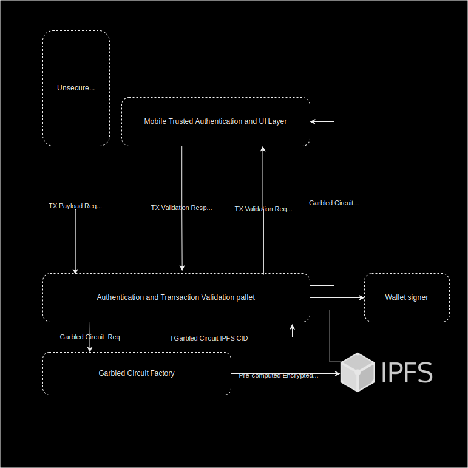

# Trusted Transaction Validation Protocol Detailed

## Transaction modules and flowchart

## TX Payload Req
Each time a transaction validation is required, a request is sent to the nodes. This request includes an operation message including transaction parameter: amount, destination address wallet.
 
## TX Validation Req 
Upon reception of the previous message the node associates a precomputed garbled circuit program on the wallet owner’s mobile app. Then computes a cryptographic mask including transaction parameters to oversee displaying of each pixel on the user's device's screen. Then this mask is sent to the mobile app with the asymmetric key to decrypt the chosen garbled circuit owned by the wallet user.

## TX Validation Resp
When the client's device receives a mask and a symmetric key, the device evaluates the circuit to display the keypad and the transaction message with a one-time code for validation. Once the transaction screen appears on the device, the user will type the one-time code displayed, on the random keypad. The response message (randomized keypad position) is then signed and sent to the nodes for validation. The wallet owner’s fingerprint and/or facial recognition is used to authenticate the user’s presence and triggers the signature of the message with the user’s mobile private key in the hardware enclave.

## The node receives TX Resp
It then uses the mobile public key provided by the mobile registry pallet to verify that the randomized position typed by the wallet owner comes from his device and that the user was present at that time. This process ensures that even if a legit garbled circuit is stolen during the transaction session, it cannot be used by another device through a man in the middle attack to validate the transaction. The node then checks if the one time code is valid to trigger the signer.
We use extrinsic unsigned transactions with signed extensions to enable the verification of the messages with the mobile public keys managed by the mobile registry pallet.
 
