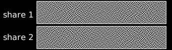

# Garbled Circuit - Visual Cryptography Screen

We use a pre-computed One-Time Garbled Circuit to generate and output Visual Cryptography Shares at 60–120 frames/second on the device framebuffer.

Those visual cryptography shares do not superpose on the device screen but only in the user's eye. Thanks to the human Persistence of Vision ability: your eye and brain retain a visual impression for about 1/30 of a second (the exact time depends on the brightness of the image). 

This ensures that an attacker won't be able to obtain the secret information (transaction message, one time code and random keypad topology) with a simple screenshot, or quickly enough to build and execute a fake User Interface. This scheme can resist current banking trojans with overlay capabilities but not targeted attacks. 
However, it makes a fake UI attack, complexe and resource intensive enough to enable us to detect it during the transaction validation session. This is the way we aim at resisting potential targeted attacks. Thanks to our proof of history of legitimate computation scheme, (roadmap/research in progress), based on a specific reusable Garbled Circuit evaluation.

Although we started by implementing a working solution that outputs visual cryptography shares we realized that it was a bit disturbing for the user and that a pure visual cryptography scheme is not crucial for our overall security model. We then decided to provide a more friendly solution for the user that is also more efficient especially regarding Garbled Circuit size.

Although our circuits still display screens at a pixel level to change fonts, characters sizes and more, let's go back to old fashioned displays to explain it.

[Transaction validation screen simulations](https://www.interstellar.gg/simulation) based on [PsychoJS library -  PsychoPy (github.com)](https://github.com/psychopy/psychojs)

At a later stage, we aim at reusing our pixel based and/or  [segment-based visual cryptography](https://citeseerx.ist.psu.edu/viewdoc/download?doi=10.1.1.84.7421&rep=rep1&type=pdf) to increase the complexity level of potential attacks and enable video recording proof scheme without disturbing the smooth user experience. 
Research lead is to leverage SRAM framebuffer speed 10-30x vs. DRAM to force the attacker to miss frames with a saturated GPU command queue filled with decoy and VC frames on high frequency displays.