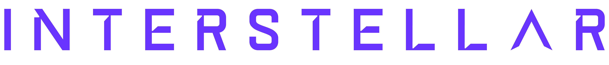
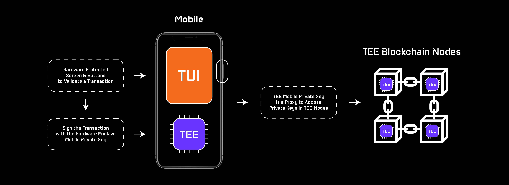
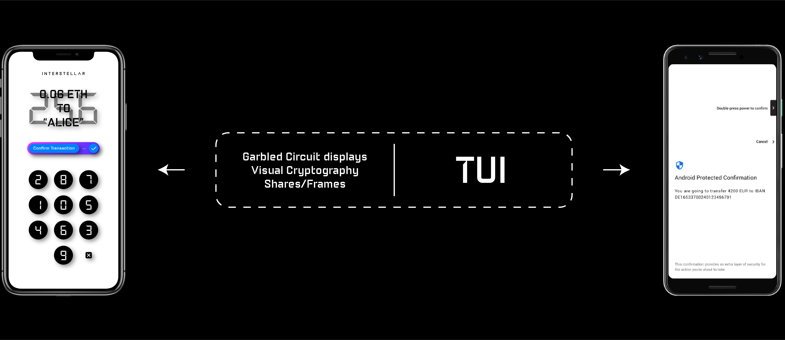

<picture>
  
</picture>

# Introduction

"The Web3 ecosystem needs a friendly user experience with hardware level security to reach mass adoption."
 
 [The Top 3 Web3 Wallet Problems](https://medium.com/@jlleleu/d53724fee1cd)

The main pain points of non-custodial wallet solutions still are:

- **User experience** | [How can Dapps attract and retain web3 newcomers](https://medium.com/@jlleleu/how-to-attract-and-retains-newcomers-10e5050ee5cb)

- **Security** | [Are Cryptocurrency Wallets more at risk than ever?](https://medium.com/@jlleleu/are-cryptocurrency-wallets-more-at-risk-than-ever-cf1ce9725de7)

> We think that current wallet solutions slow down the DeFi adoption.

Interstellar is a novel non-custodial mobile multichain wallet with hardware level security. Based on a Substrate blockchain and SubstraTEE/IntegriTEE workers connected to a mobile, the wallet solution comes without passphrases or any other secrets to store or remember.

Thanks to Trusted User Interfaces on mobiles and Trusted Execution Environments in both mobiles and blockchain nodes, we can now provide the same hardware security level as hardware wallets with only a mobile and a blockchain - Unlocking an unmatched user experience.

Because TUI is not yet avalaible on all mobile devices, we use a Garbled Circuit/Visual Cryptography scheme which provides an alternative that will be complementary down the road to mitigate potential flaws in TUI.

<!-- 

 -->

#### Features:

- **Multichain wallet** - securely store and interact with native cryptocurrency coins, tokens and NFTs from multiple blockchains

- **Easiest set-up in the ecosystem** - no private key, passphrase, password, pin or login

- **Hardware level security** - TEE on blockchain nodes and mobiles (incl. TUI), Garbled Circuits and Visual Cryptography

- **Simple Recovery Services** - leverages the existing Substrate pallet for social recovery + a novel decentralized autonomous recovery service based on NFC

- **Send crypto with social network messages** - share a link that includes a pending transaction, even to friends with no wallet: explained in [Can an easy to set-up wallet be an efficient customer acquisition tool for DeFi players?](https://medium.com/@jlleleu/can-be-an-easy-to-set-up-wallet-an-efficient-customer-acquisition-tool-for-defi-players-8600812fe01e)

- **Confirm a transaction with ONLY ONE SCREEN** - no SMS to wait for, no additional 2FA app to use, no QR code to scan

- **Up to 1,000,000 tps** - no tps limit due to slow consensus, thanks to IntegriTEE layer 2 based on hardware enclave technology

#### Our solution is designed to support blockchain and DeFi mass market adoption with:

- **A decentralized key & asset management service** | The user’s private key and signature programs are stored and executed in TEE nodes

- **A decentralized Trusted Transaction Validation Protocol** | Leverages TEE and TUI features on mobile, combined with One Time Garbled Circuits and Visual Cryptography to provide a Trusted Authentication and Trusted UI layer on user devices
